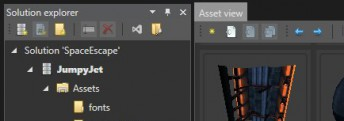
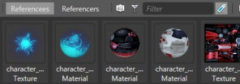

# Game Studio interface

**NOTE: This page describes the interface of the version 1.0.0 of Xenko. The documentation for the version 1.1.0 is coming soon!**

Once you've created or opened a project, the Game Studio shows the following interface:

 

# Main interface

This interface is split into multiple sections explained here.

## Solution explorer

The solution explorer displays the hierarchy of your game. For more information about the project hierarchy, see the [Game project hierarchy](game-project-hierarchy.md) page.

 

The packages are separated in two categories. **External packages** are packages that you downloaded from the internet, such as the default Xenko package.

**Local packages** are your owns.

If you opened a package file (.xkpkg), you should see a single package in the Local package category. If you opened a solution file (.sln), you may see several packages if the solution contains more than a single package.

Each package contains three base elements.

- The **Assets** element contains all the assets contained in this package. You can expand it to see the same hierarchy between assets that on the file system. When you select an asset folder, the Asset view will display the asset contained in this folder.
- The **Code** element contains the code libraries and executables of the package. They each correspond to a single csproj file. By right-clicking an executable, you can set it as current project which allows you to compile the assets for the related platform and launch the game.
- The **Dependencies** element list all packages that are referenced by the package. The packages in this list have their assets accessible to this package.

From the Solution explorer, you can create or add existing packages in your solution, or C# projects in your packages. You can also manipulate the hierarchy by creating folders, renaming or deleting objects, etc.

## Asset view

The asset view displays all the assets contained in the folder currently selected in the Solution explorer. Assets can be viewed in a tile view with thumbnails, or in a more compact grid view. This panel provides tools for searching or filtering assets in its tool bar. You can also create new assets or imports ones.

When you select one or multiple assets, you can view and edit a lot of information, as described in the following sections.

 

## Property Editor

The property grid displays the property of the selected asset. If you selected multiple assets, the common properties will be displayed. Depending on the type of asset you selected, you can changes how the asset will be imported or how it will behave in the game.

 

## Asset preview

This panel will display the asset as it will be rendered in the game. The preview depends on the type of asset you selected. For a model, it will display it with its material and allow to rotate the camera around. For animations and sounds, it is possible to playback and seek with a timeline. There is nothing to edit in the preview ; it is just a visualization tool.

 

## Dependencies

This panel shows the connection between the different assets. There are two tabs, **Referencees** and **Referencers**. The first one will show all the assets required by the selected asset. For instance if you selected a model, you will see all the materials and textures it uses to be rendered. The second tab gives the opposite view: it lists all the assets that require the selected asset. If you selected a texture, you will get all the materials, and by extension all the models, entities, etc. that need this texture.

 

## Asset log/Build log

Two tabs below the References panel allows you to display logs of the Game Studio. The first one, Asset log, will show you any warning or error on the assets of your project. It might be invalid properties, broken references, and so on. The second tab, Build log, will display the log when you build the assets of your project. Errors will appear here if the build engine is unable to compile some of your assets.

## Action history

The action history is accessible via the tab below the Asset preview. it displays a list of all actions that you did. You can undo or redo almost any of the action you do. This view will show you what is currently done, and what has been undone.

