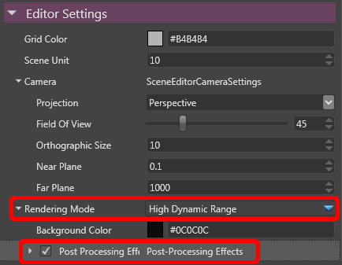
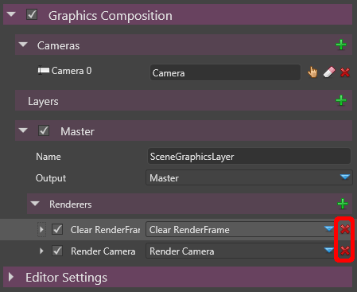
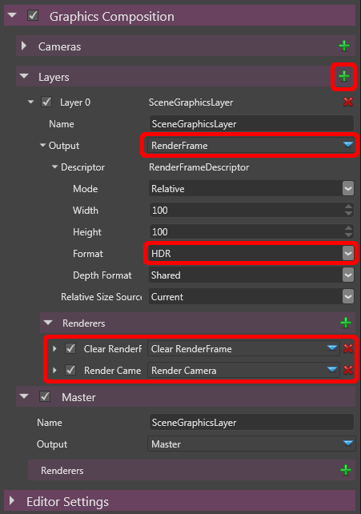
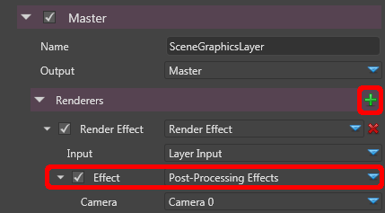
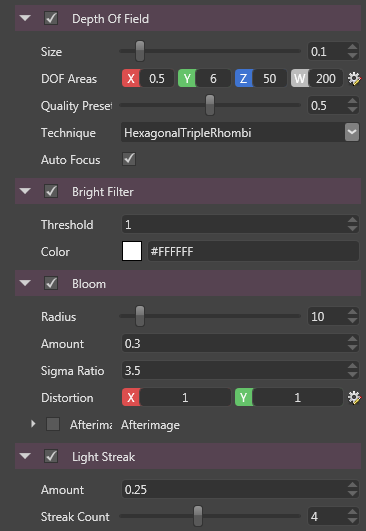

# HOWTO: Add post-effects

Post-effects are image processing algorithms applied to the scene rendered by the engine.

They can simulate bloom, depth-of-field, color-aberration, noise...

You would typically apply a post-effects after the main game scene is rendered, but before rendering the UI.

# Previewing post-effects in the editor

Some post-effects work well with LDR (low-dynamic range) buffers but many others give best results with HDR (high-dynamic range) buffers.

This is especially true for the glare effects like bloom, light streaks, lens flares...

You can switch the editor preview to HDR by clicking the **Root** of your scene, and in the property grid, change the Rendering Mode from **"Low Dynamic Range"** to **"High Dynamic Range"**.

 

 

You can now unfold the new child **"Post Processing Effects"** to set-up the post-effects.

All your changes should be immediately previewed in the editor window.

# Setting-up post-effects in your game

By default, the rendering is done in the back buffer.

However for post-processing we want to render to an intermediate buffer, before we send the final result to the back buffer.

So first, let's remove the renderers for the back buffer.

In the **Graphics Composition** of **Root**, remove the **Clear RenderFrame** and **Render Camera** renderers.

 

 

Then let's add a layer where our scene will be rendered.

- Click on the **+ sign** next to layer.
- Set the **Output** to **RenderFrame**, and in the descriptor set **Format** to **HDR**
- Add back the renderers we had for Master by clicking on the **+ sign** next to **Renderers** and add a **Clear RenderFrame** and a **Render Camera**.

 

Now let's set-up a post-processing renderer in Master which will use the result from this layer.

In Master, click on the **+ sign** on the right of **Renderers** and choose **Render Effect**. 

In the **Effect** drop-down menu, select **Post-Processing Effects**.

 

And that's it, you can now configure the post-effects in the **Post Processing Effects**, just like for the editor preview.

# Post-effect Overview

Several built-in post-effects are available, you can toggle each of them with the check-box next to their name.

Very often, a post-effect has a simple quality settings between 0 and 1, so you can easily choose between performance and quality.

 

Here is a quick overview of each post-effect.

### Depth of Field

This simulates a camera lens by making the areas which are out-of-focus appear blurry compared to the rest of the image.

In-focus areas stay sharp.

The bright points which are out-of-focus create some typical bokeh shapes (circular, hexagonal...).

### Bright Filter

This is not a post-effect per-se, it is here to control the threshold of luminance above which we consider a color to be "bright".

### Bloom

The bloom effect makes the brightest areas spread and "bleed" over the surrounding areas. 

You can control the strength of the effect, as well as the retinal persistence through the "Afterimage" sub-item.

### Light Streak

Bright points will be stretched along some directions, in a star-like pattern.

You can choose the number of streaks, their directions and the strength of the effect. 

An anamorphic mode is also available to simulate the behavior of anamorphic lenses.

### Lens Flare

The lens flare effect simulates the visual artifacts created by the internal reflection and scattering of the light inside a lens. 

This usually produces a series a bright spots along the axis formed by the original bright spot and the center of the screen.

### Color Transforms

The **Color Transforms** is a collection of filters combined into a single shader at runtime. It is designed to be efficient and applied in a single draw-call: each transformation takes as input the output of the previous transform.

Color transforms available are:

- **Film Grain:** Applies a noise at each frame to make your render look like a film.
- **Vignetting:** Darkens the corners/edges of the frame.
- **Tone Mapping:** Re-maps an HDR buffer to a LDR buffer. Several operators are available: not only the traditional *Reinhard,* but also the *Hejl-Dawson* or other filmic operators...
  
  You can also tune here the behavior of the auto-exposure of the scene.
- **Gamma Correction:** Remaps the range of value of the frame to match the specified gamma value. 

### Antialiasing

An FXAA filter can be enabled to smooth out the jagged lines appearing on the edges of the meshes rendered in the frame.

 

