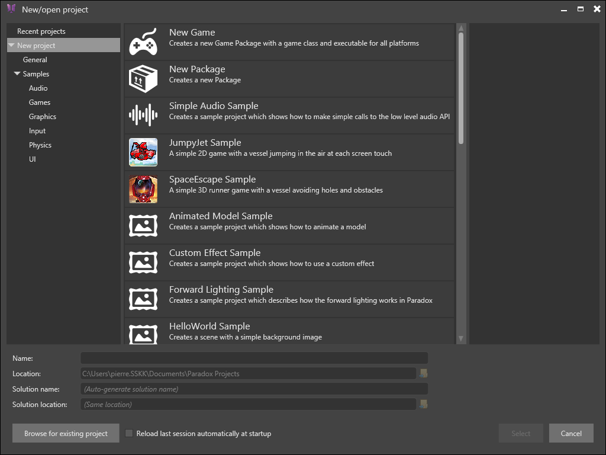
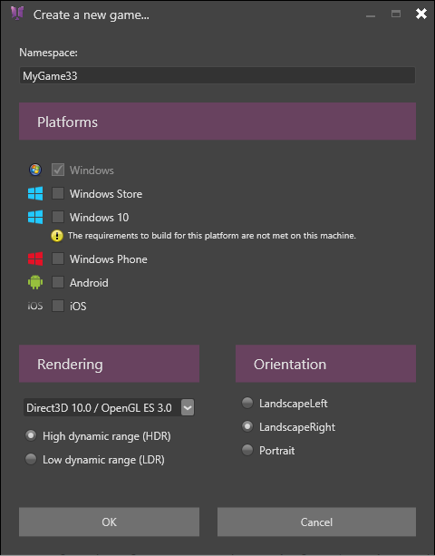
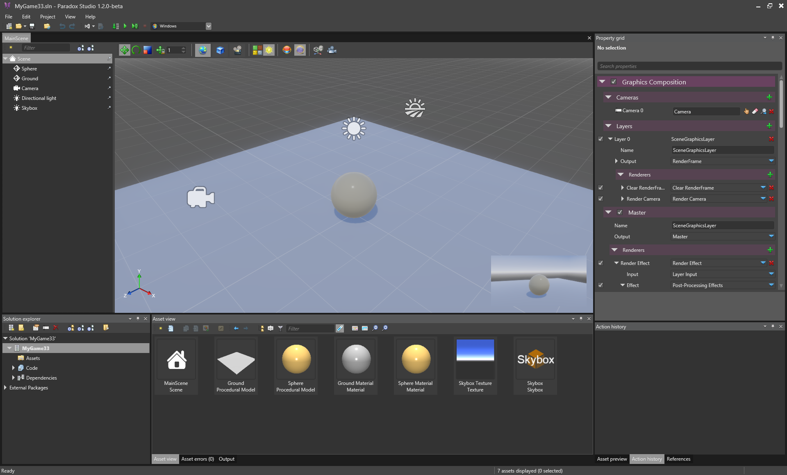
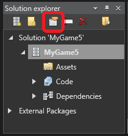

# HOWTO: Create and setup new game

# Project creation

After installing Xenko, click on the **Start** button of the launcher to start the Xenko Studio application and getting started working on your game.

A window opens where you can choose a template to start with.

 

Note that Xenko is shipped with many samples introducing various features of the engine, including graphics, audio, physics, UI... Two game samples are also available: JumpyJet, a 2D scrolling game, and SpaceEscape, a 3D runner game. Feel free to check these samples to learn how to work with Xenko!

But for the moment, let's start with a new game project by selecting the **New Game** template. This option will create a very simple but functional project that we will describe later.

Also notice the **New package** template. This option allows you to create game packages that are not specifically a game (ie. they do not produce executable), but rather a library of asset, scripts, etc. that you can share between multiple projects.

After validating, you are invited to select the configuration of your game.

 

First are the **platforms** you'd like to target. If you do not have requirements needed for a platform a warning message is dispayed.

Note that without a [Xamarin ](https://xamarin.com/platform) license, you won't be able to build your game on iOS or Android, although you can still create a project for these platform and get a license later.

Then is the **rendering** configuration. You need to choose the graphic API that you want to target. The later is the API, the more advanced are the graphic features you can use. Nevertheless you need to be careful, not all graphic cards support latest APIs (especially if you target mobile devices is which case you should probably restrain yourself to profile 9_1 or possibly 10_0). The next thing you need to select is the range of the color you want to use (High or Low). **LDR** sets up your scene to use color values between 0 and 1. **HDR** allows you to use random float values as color. HDR is offers you much more possibilities but is also much more costly and complex.

Last is the **Orientation** of your game. For most PC games, the orientation will be Landscape. Portrait is mostly used for mobile games.

# Initial setup

The created project contains all the necessary for a very basic game. In the center part of editor is opened the **default scene** of your project. In this scene, you can start to construct your game by drag-and-dropping elements from the asset view. On the left panel is your **scene hierarchy.** You can see all the elements that are included into it and their relations. For the moment the scene is basic and contains only a ground, a sphere, a camera, a directional light and a skybox (surrounding image). The objects you add in the scene are called **Entities**. Each entity can contain one or multiple components, allowing to associate *models*, *sound*, *sprites*, *scripts* together. More information on entities is available in the next tutorials.

 

 

On the bottom of the screen, you can see the **Solution explorer**, where you can see the hierarchy of your project. Currently you should have a solution with the name of your game, containing a single game with the same name. Three directories are displayed inside: The **Assets** folder, root of you asset hierarchy, The **Code** folder, listing the C# libraries and executables contained in your project, and the **Dependencies** of your project, which contains a reference to the Xenko package. This special package, accessible in the **External Packages** category, represents the Xenko engine itself. Some assets from this package are accessible to your project, especially effect shaders. More information on shaders and the rendering pipeline is available in the next tutorials. The **central part** displays the assets contained in the **selected** directory.

The right part of the screen contains the **property grid**, displaying the properties of the currently selected object. It also contains several useful windows: the **asset preview** tab will, as you might guess, show a preview of the selected asset. Note that some assets cannot be previewed (scenes or shaders for instance). The **References** tab is a convenient way to navigate in your project: it displays both the asset referenced by the selected asset (if you selected a material, it will display the textures it uses), and the asset that references the selected asset (the models that uses the selected material). The **Action history** tab shows you all your last actions in the editor and can be used to undo actions.

As will we start to fill the scene in the following tutorials, let's first check a few things on the project itself. By clicking the Package properties button in the solution explorer, you can display the global properties of your game.

 

Here you can select the **screen resolution** of your game. Note that on mobile devices, this resolution might be stretched to fit the screen resolution. The default graphics profile describes the level of rendering feature you want to use for your game. The higher you choose, the more fancy rendering you can do, but the higher the hardware requirement will be to play your game. Then you can also change the **default scene** of your game. A game always need to have a default scene to load, even if it is empty. You can add (statically or dynamically) scenes into other scenes using entities and components. Finally are the parameters for **Effect compilation**. This dictates how the engine should behave at run-time when he encounter an effect that is not compiled. Local means that the game compile the effect itself (available on Windows only). Remove means that it connects to the editor server that compile the effect for him. None means that all the effect should be compiled at build-time only. For more details about effect compilation see [here](howto-generate-effects-on-mobile-devices.md).

 

 

Now it is time to [fill our game with some assets](howto-create-or-import-asset-data.md)!

 

 

