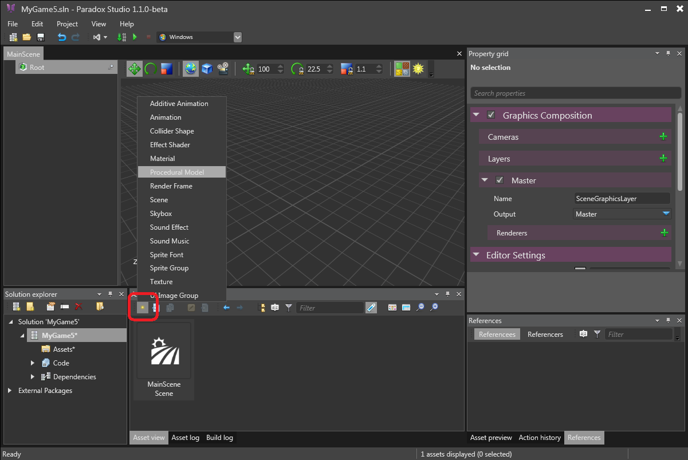
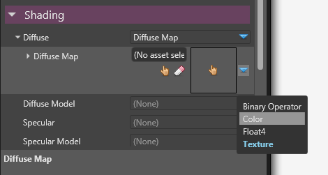
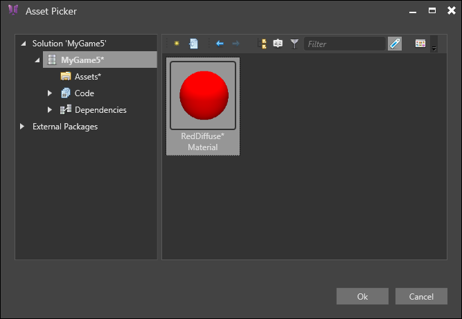
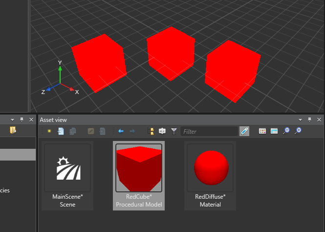
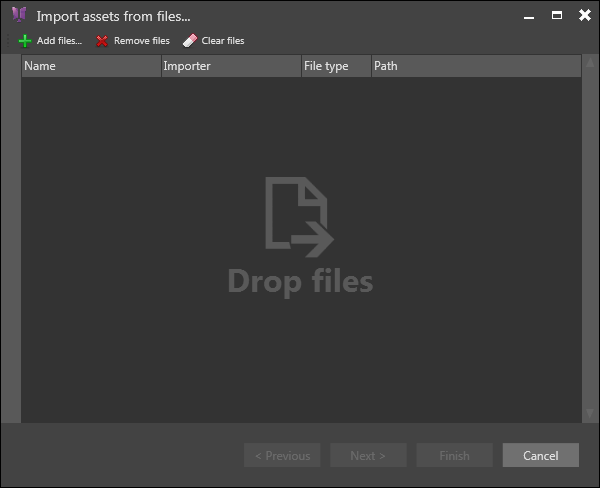
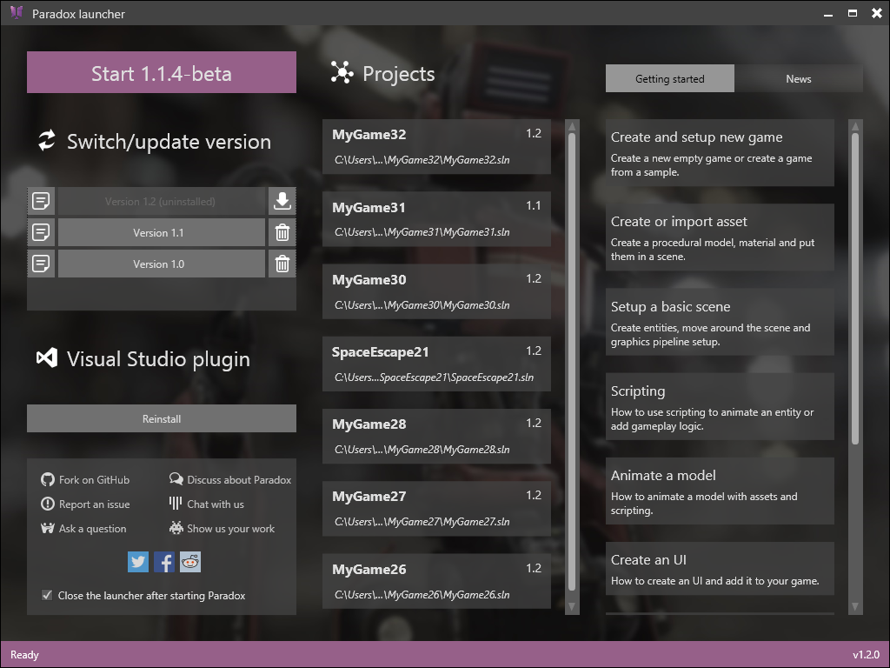
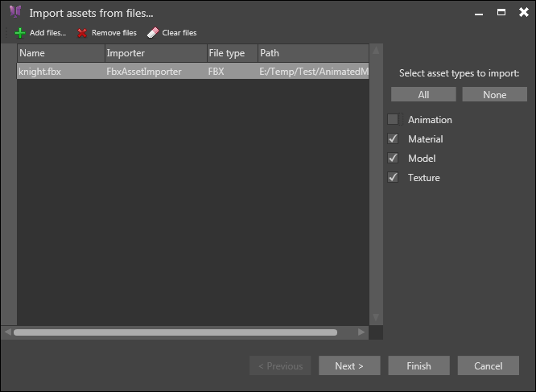
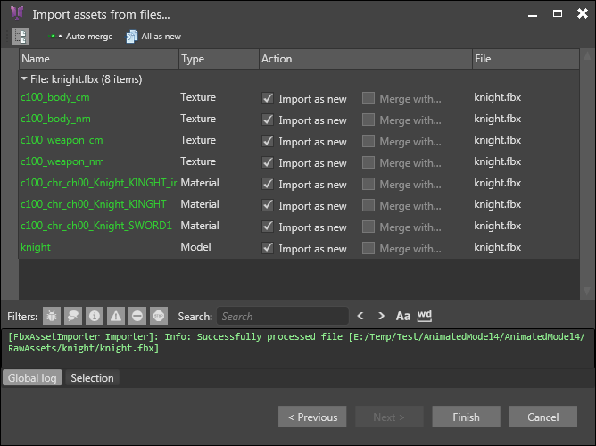
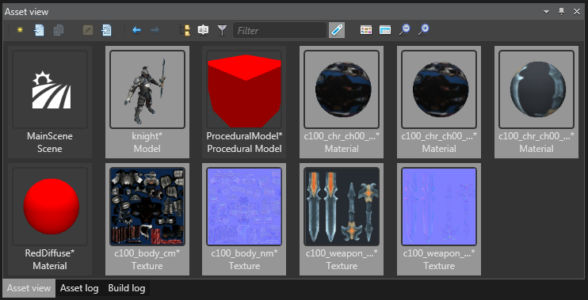

# HOWTO: Create or import asset data

Xenko supports [many asset files ](http://paradox3d.net/features/assets) that can be imported in your game. There are two ways to add assets in your project: by creating new ones, or importing them from file. With the exception of 3D model that you must import, any asset type that can be imported can also be created as empty, and then configured manually. Note that some assets, such as procedural models, cannot be imported and must be created from scratch.

# Creating new assets

Let's start by creating a procedural model. Just select **Procedural model** from the **New asset** drop-down button of the **Asset View** tab. This will create a new asset at the current location.

 

Press **F2** or right-click on it and selecting **Rename** to give it a name.

 

If you check the preview of this asset in the Asset preview tab, you'll seen that it is indeed a cube, but it is not red! Let's create a material for it. Note that materials can also be imported from model files, but since we are using a procedural model, we must create it ourselves.

Just use the **New Asset** button again and select **Material**. In its property, find the Diffuse property and set it to **Diffuse map**. By default, the diffuse map is a texture, but it can also be a color. Press the drop-down button on the right of the new diffuse map and select color. Then you can click on the color picker and select a red hue.

 

At this point the preview of the material is still black, because we must also set the diffuse model to use. Select **Lambert** in the **Diffuse Model** property and things should become colorful.

Now select back the procedural model we created earlier, and click on the hand icon in the Material property. An asset picker opens where you can select the red material.

 

Here's our red cube! Just for fun, you can try to drag and drop it into the scene and see what happens! The scene editor itself we be explaining in a following tutorial.

 

# Importing assets

Let's continue by importing a model in our project. Click on the **Import assets** button (just beside the **New Asset** one).

 

The importer window will open:

 

Then you can either drop files from the Windows Explorer or click on the   button to add files to import. In this tutorial I will use the *knight.fbx* model that is available in the **Animated Model** sample. After adding the file to the list, a menu appears on the right allowing to set which type of asset to import. In this case we want only the model, its material and its texture.

 

The importer will automatically add the texture files referenced in the fbx file to the list of assets to import. Lets press Next to see what happens.

 

The log informs us that the asset was correctly processed. Eight assets will be created: 4 textures, 3 materials and 1 model. Since this is the first time we import this model, the action to do for every asset is **Import as new**. When iterating on models, you might want to re-import it later, to take account of added/removed materials and texture. In this case, the importer will propose you to merge the imported assets into existing ones. You can still re-select Import as new if you wish to create new assets from an already imported fbx file.

Note that you can also decide to discard some of the assets in the list. For example, suppose you already created materials in your game to use for this model, and you want to them instead of creating new assets. In this case, simply uncheck the **Import as new** option. The model will be imported with empty material references and you can set them afterward.

Let's press Finish and see what we got!

 

A bunch of new assets has been added to our project! You can now customize the properties of each one, tweak the materials, and again, try to drop the knight model into the scene!

