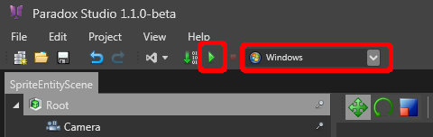
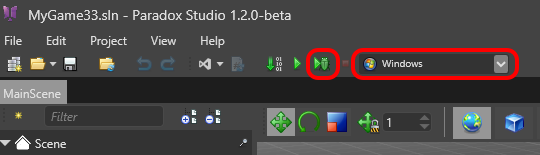
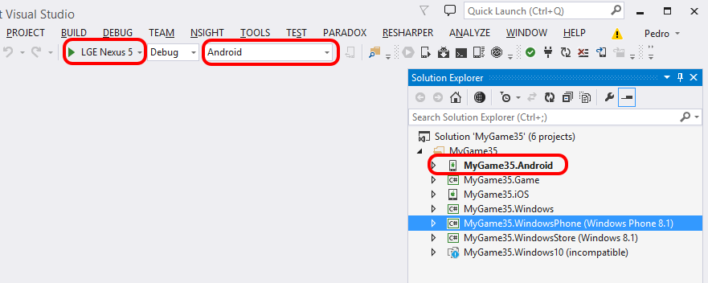

# HOWTO: Execute a game

Let's try to run the game now!

# From the Game Studio

#### Simple run

In the top-left menu, just select the platform you want to run on, and click the small green triangle. 

This will compile your game and run it as soon as it is ready.

 

#### Live scripting 

Since version 1.2 of Xenko, it is now possible to perform live scripting. This means editing your scripts and see result in live in your game without having to restart it.

In order to be able to do this though, you need to start your game is a specific mode. Instead of the green triangle button click the small bug button. Note that for the moment live scripting is available only on Windows.

 

# From Visual Studio

Alternatively, you can run your game directly from Visual Studio without going through the Game Studio. The process is slightly more complex though.

You need to set manually both the start-up project and the matching build configuration (in the below example *Android*). Then you just need to click on the debug button (green triangle) to compile and run the game.

 

Note that you can't do live scripting from visual studio for the moment.

 

