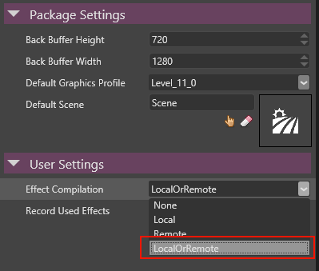
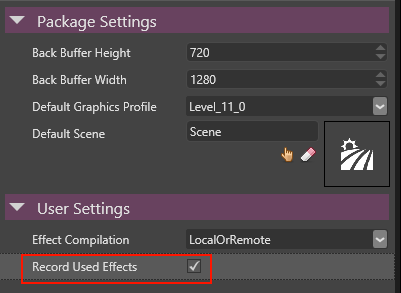
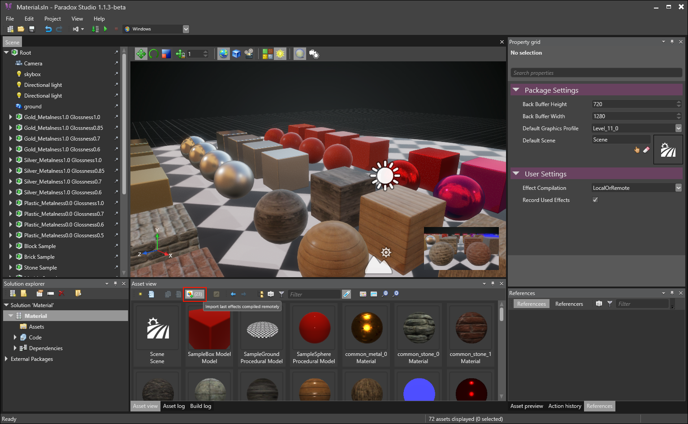
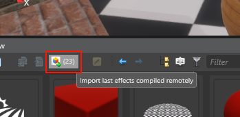
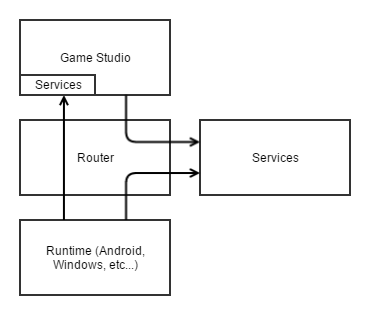
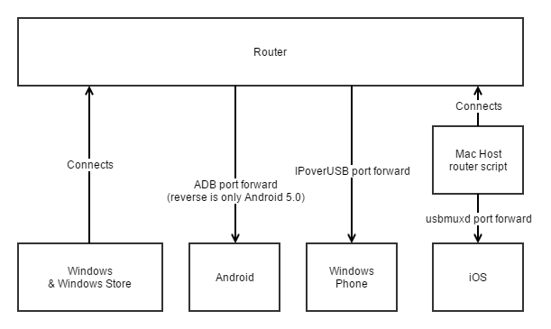

# HOWTO: Generate effects on mobile devices

As a current limitation, Xenko can't compile shaders directly on mobile devices, and even if supported on Windows, it might take some time and freeze your game.

As a result, we recommend you to precompile effects so that your game works smoothly on any platform.

# Allow remote compilation (to develop on mobile platforms)

As a developer, this mode is useful when you are developing and iterating on your game.

Right click on your package and click "Package Properties". Then, switch "Effect Compilation" to "LocalOrRemote". This will make platforms that don't support effect compilation connect back to developer PC, and compile effects remotely.

   

As a result, you can seamlessly develop your games on mobile devices without worrying of pre-generating effect permutations.

> **Error**
> 
> 
>     
>             
>     
>     
> 
> Do not forget to switch back "Effect Compilation Mode" to Local or None before distributing your game, so that it doesn't open connection (and block on them if only "Remote" is enabled).    

# Record effect compilations (before redistributing package)

As you want to deploy your application for testing or release, effects should be included in the distributed package.

In order to do so, go to "Package Properties" and enable "Record Used Effect" option.

 

Launch again your game. It will connect back to GameStudio automatically and notify it of any effect that are required to run this game session.

In the Asset View, GameStudio has an "import last effects compiled remotely", with a number next to it showing how many new effects would be added (if greyed out a, it means no effects have been compiled, or you have already imported them).

  

As soon as you click the button, shaders will be imported as "EffectLog" asset. This asset contains shader permutations, and will be used on next compilation to pregenerate those shaders. You should then be able to compile and deploy your game on any platform.

> **Note**
> 
> 
>     
>             
>     
>     
> 
> If you run the game again, GameStudio will let you know only when there is new effects that are not already in the "EffectLog" asset. This allows you to record effects in multiple runs.
> 
> Also, if you want to restart from scratch (i.e. remove old unused effect permutations), you can simply delete the "EffectLog" asset.    

If you want to make sure you game contains all its effects permutations, you should switch "Effect Compilation" to None. If an effect is missing, it would crash.

> **Error**
> 
> 
>     
>             
>     
>     
> 
> Do not forget to untick "Record Effect Requested" before distributing your game.    

> **Error**
> 
> 
>     
>             
>     
>     
> 
> We might invalidate current Effect Log assets in Xenko new version, so you might need to regenerate it during some version upgrades.    

# Running games from Visual Studio

As long as GameStudio is launched in the background with your project opened and previously described "Package Properties" such as "Effect Compilation" set and saved, you can launch it from Visual Studio as well.

New effects can still be imported on GameStudio side.

# Special case: iPhone

Since iOS is done with Xamarin Studio through a remote MacOSX host, a connection need to be established between the iOS phone and the Windows developer computer.

As a result, you will need to run a script that can relay iOS connections back to developer computer.

Go into `%SiliconStudioParadoxDir%\GamePackages\Xenko.1.1.3-beta\Bin\Windows-Direct3D11` and copy `ios-tcprelay` folder to your MacOSX host.

Run it with your developer host/IP:

```cs
# replace 192.168.1.2 with hostname or IP of your Windows PC running GameStudio
./xenko-ios-relay.py 192.168.1.2```


It should start displaying information about connected iOS devices, and connections established.

# How it works

A "Connection Router" server will be launched by GameStudio automatically when a project is opened.

Then, games will connect to this router and ask for a "Effect Compiler Service" to send notification and request of effects to compile. GameStudio will also connect to it to be notified of new effects that were required.


 


In order for games to properly establish connections to router for all the platforms that we support, we sometimes use platform tools (such as "adb forward") to establish port forward connections. Here is how we connect to each platforms:


 


 

