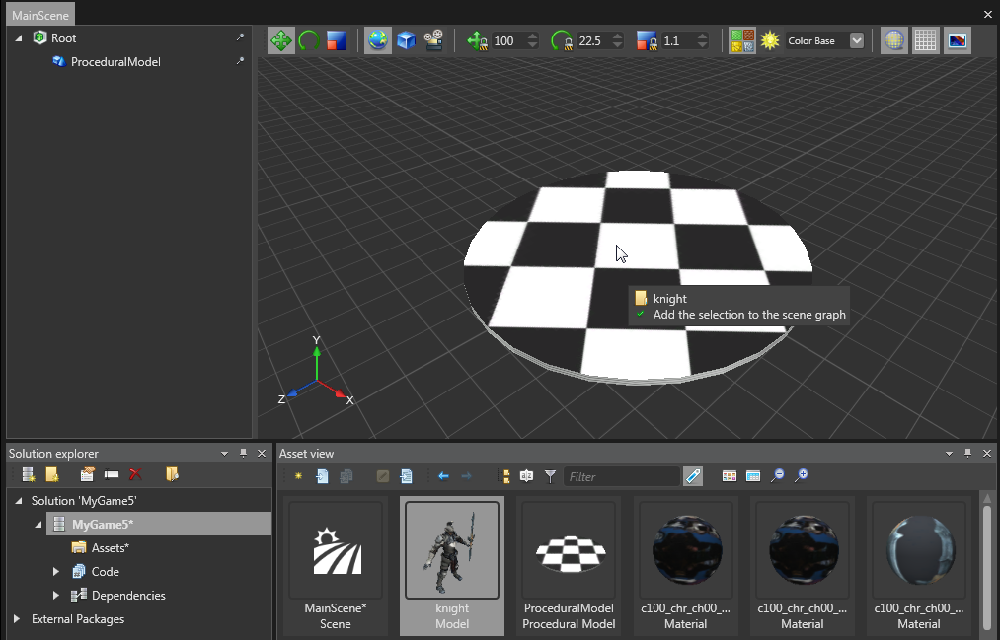
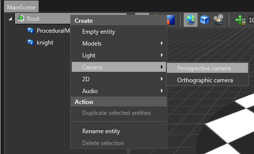
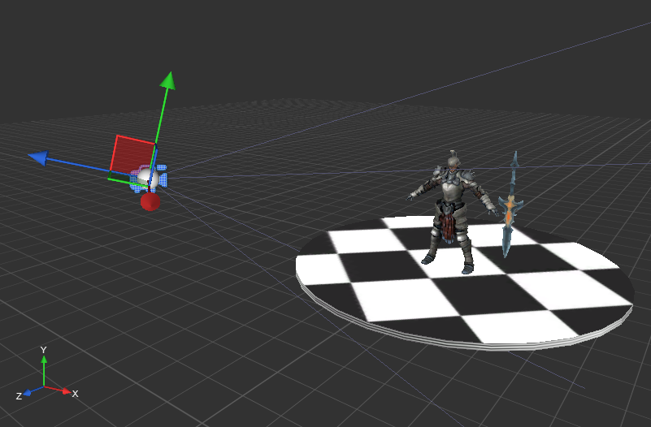
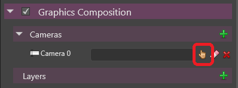
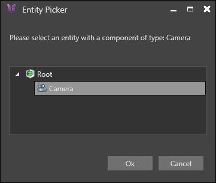
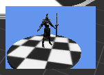
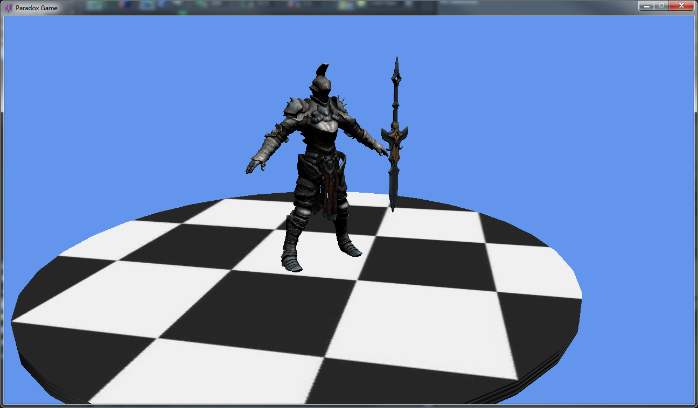

# HOWTO: Setup a basic scene

In this tutorial we will start from a basic project where [some assets have been already imported](howto-create-or-import-asset-data.md).

# Adding some entities

Objects in a scene are called **Entity**. Each entity can have one or multiple **components**, such as model component, audio component, etc.

You can drag and drop models from the Asset view either directly on a location in the scene viewport, or in the scene graph on the left, to create entities with a model component that use this model.

 

To move the camera in the scene editor, use the W,A,S,D keys and move the mouse with the right button pressed.

Now that we have some entities in our scene, let's try to setup a camera to be able to view them in-game.

Right-click on the root node of the scene and add a perspective camera. A camera is basically an entity with a camera component. The perspective camera will be pre-configured to use a perspective projection.

 

Then use the gizmos to place the camera. Simply drag the arrows, planes or circles to make the selected object move. You can manipulate gizmos with the following buttons.

 Activate the translation gizmo to change the position of the selected entity

 Activate the rotation gizmo to change the orientation of the selected entity

 Activate the scale gizmo to resize the selected entity.

 

The gizmo can different space coordinates

 Use the world space coordinates (same X, Y and Z axis for every entities)

 Use the object space coordinates (the axis are oriented in the same direction that the selected entity)

 Use the camera space coordinates (the axis are oriented in the same direction that the editor camera)

 

 

# Graphics pipeline setup

Now that we have a camera, we can setup the graphics pipeline. Click on the top **Scene** node of the scene to display the scene properties.

In the **Graphics Composition** category of the properties, add a new camera slot, and click on the hand icon to assign it to the camera you just created.

 

 

Below the camera list, you can see the **Layer** list and the **Master** layer. The layer list won't be covered in this tutorial, but we're going to fill the **Master** layer right now.

We will do a very basic pipeline: at each frame, we just clear the buffers and redraw the scene from the camera. Go to the renderer section and add a **Clear RenderFrame** and a **Render Camera** items in the list. The Render Camera will automatically be bound to the **Camera 0** that we previously associated to the camera entity of our scene, so basically we don't have to change anything. A small preview of the scene will appear on the bottom-right corner of the viewport.

 

As you might have noticed, the scene is currently rendered in black. That's because we have no light!

Right click on the viewport or on the root node of the scene and select Directional Light from the Light menu. Now you should see some color.

 

Wanna see it for real? Just press the play button on the top of Xenko Studio. This will properly build the assets and launch your game.

 

As you can see, your scene now contains some objects with a proper camera and some lighting. But it's still a bit static... Check the next tutorial to add scripts and animations!

