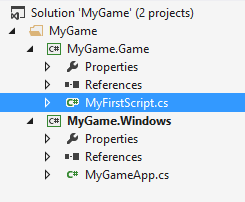
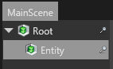
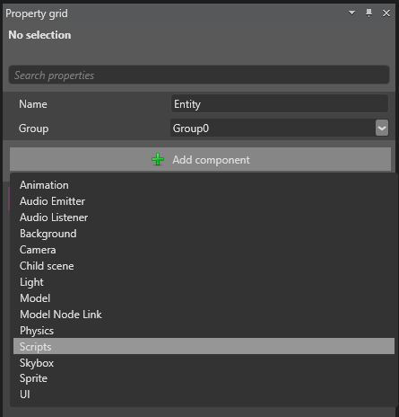
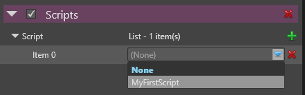
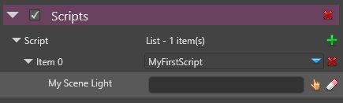
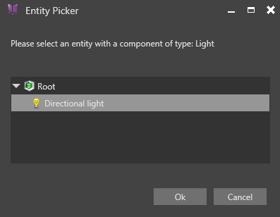
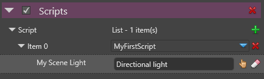

# HOWTO: Use scripts

After that your created your first basic scene, the first thing that you probably want to do is to move and animate your entities. **Scripts** are the most suited way to do that in Xenko. 

# Scripts

Scripts are portions of code that the user can write to control his elements in the scene. 

In Xenko, all the scripts are written in **C#** and provide **access to the entire API** of the engine (Low level API included).

There are two main types of scripts: **Synchronous** and **Asynchronous**. See engine documentation for more detail about each type.

# Create a new script

To create a script, first you need to open your game package solution in **Visual Studio** (for example *MyGame.sln*).

Once you have opened the solution, create a new C# file in the Game project.

 

Make your script ***public*** and inherit from `AsyncScript (ref:{SiliconStudio.Xenko.Engine.AsyncScript})`, `SyncScript (ref:{SiliconStudio.Xenko.Engine.SyncScript})` or simply `Script (ref:{SiliconStudio.Xenko.Engine.Script})` depending on the type of script you need.

**Code:** Empty Script

```cs
using System.Threading.Tasks;
using SiliconStudio.Xenko.Engine;
namespace MyGame
{
    public class MyFirstScript : AsyncScript
    {
        public override async Task Execute()
        {
            while (Game.IsRunning)
            {
                await Script.NextFrame();
            }
        }
    }
}```


# Attach the script to an entity

The next step consist in attaching the script to an entity of the scene.

To do that, first that **build** the game project in Visual Studio.

Then, open the project in the game studio (for the moment, you need to close and re-open the studio it if you had it already opened. This problem will be fixed in near future).

Open the scene if is it not already done. Select the entity you want to add the script to in the scene hierarchy.

 

Add a **ScriptComponent** if one does already exists.

 

Finally add a **new entry** in the script list and **select your script** in the unrolling list.

 

# Implement your script

Now it is time to add code in your script.

Return to Visual Studio and open your script file (here *MyFirstScript.cs*).

Using the **script context** (available from any type of script), you can easily **access any base system of the engine as well as the script entity.**

The script entity is the entity to which the script has been attached to. It can be accessed using the `Entity (ref:{SiliconStudio.Xenko.Engine.Script.Entity})` property of the script.

Using the script entity property, you can **access all the components** of the entity and **alter its current state**.

For example, here is a simple script that shows you how to have an entity rotate around its Y axis.

**Code:** Simple Rotation Script

```cs
using System.Threading.Tasks;
using SiliconStudio.Core.Mathematics;
using SiliconStudio.Xenko.Engine;
namespace MyGame
{
    public class MyFirstScript : AsyncScript
    {
        public override async Task Execute()
        {
            while (Game.IsRunning)
            {
                Entity.Transform.Rotation = Quaternion.RotationY((float) Game.UpdateTime.Total.TotalSeconds);
                await Script.NextFrame();
            }
        }
    }
}```


# Add references to other scripts or entities

Having access to the script entity is great but as soon as your game get a little bit complicated, you will probably need to also **access other entities** from your script.

For that you can surely scan all the entities of the current scene, but there is actually much more **convenient and efficient way to do that.** 

**You can add extra entity, component or script fields to your script and set their value via the Studio.**

Here is an example of how to process. Let's say that you want change the light settings in your script.

First start by adding a ***public*** field of type LightComponent (it works the same for Scripts, Entities and other components).

Access and use it as you please in your script code.

**Code:** Access external components

```cs
public class MyFirstScript : AsyncScript
{
    public LightComponent MySceneLight;
    public override async Task Execute()
    {
        while (Game.IsRunning)
        {
            var time = (float) Game.UpdateTime.Total.TotalSeconds;
            Entity.Transform.Rotation = Quaternion.RotationY(time);
            MySceneLight.Intensity = (float) Math.Cos(time);
            await Script.NextFrame();
        }
    }
}```


Now, go to the Studio and re-open the project (live update of script will be supported in future version so that this step won't be needed anymore).

You should be able to see a new field that appeared under your script.

 

Click on the asset picker (small hand), and set the light you want to alter.

 

Now you should see it set in the property field, as bellow:

 

Now try to execute the game. The field reference should automatically be set at run-time before entering in your script, and you should be able to see the modification on the light.

 

