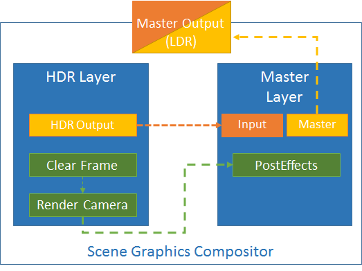
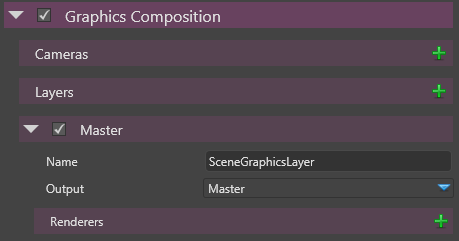
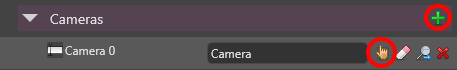
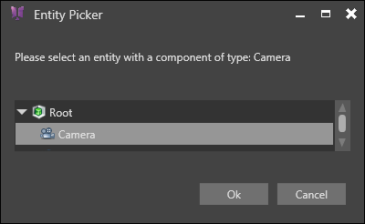
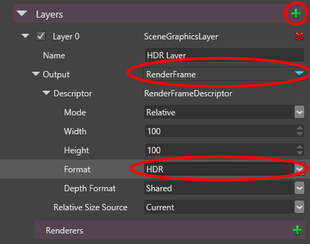
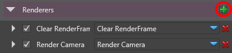
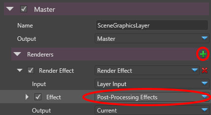

# How do I setup a HDR pipeline with posteffects?

Assuming that you are already familiar with the  [Scene Graphics Compositor](../graphics-reference/graphics-compositor-reference/index.md), we would like to setup a High Dynamic Range rendering pipeline.

The principle of HDR rendering is to render to a scene to a HDR render target and then apply a Tone Mapping to convert HDR to a LDR render target to display it on the screen.

| LDR Rendering                                                                                                                | HDR Rendering                                                                                                                |
| ---------------------------------------------------------------------------------------------------------------------------- | ---------------------------------------------------------------------------------------------------------------------------- |
|   |   |

> **Note**
> 
> 
>     
>             
>     
>     
> 
> As part of the Graphics Compositor, we will provide a set of default pre-configured rendering paths including a HDR to LDR rendering path as described here.    

# Step0: Visualize the pipeline

We would like to setup the following pipeline:

 

 

Without a HDR to LDR rendering path, a scene illuminated with several lights with high intensities would just look white:

 

# Step1: Go to the Graphics Compositor Properties

In the current scene, select the root entity

 

The properties of the graphics compositor are editable in the Property Editor:

 

# Step2: Add a camera slot and Select a Camera

Click on the   on the Cameras category:

 

And then click on the finger point to select a Camera in a Scene (If you don't have a camera in a scene, right click on the root scene to create a new camera)

 

# Step3 : Add a layer and create a HDR RenderFrame Output

- Then add a new layer. Change the name to HDR Layer
- In the Output, select **RenderFrame**
- In the **Format property** of the RenderFrame, select **HDR**

 

# Step 4: Add Renderers to the HDR Layer

Then on the HDR Layer, you can click on the Renderers   and add the following renderers:

- Add a **Clear RenderFrame**
- Add a **Render Camera**

 

# Step 5: Add a Render Effect to the Master (LDR) Layer

Now we need to transform the HDR output of the HDR Layer to the renderframe LDR of the Windows output

- Add a **Render Effect** by clicking on the Renderers 
- For the Effect, select "**Post-Processing Effects**"

 

# Step 6: Configure the Post Processing Effects with a Tone Map operator

On the Post-Processing Effects

- Disable all non-necessary effects (Depth Of Field, Bright Filter...etc.)
- In the Color Transforms, press   to add a new color transformation and select the **ToneMap** transform

 

The scene should now look more natural instead of a saturated white:

 

 

 

 

 

