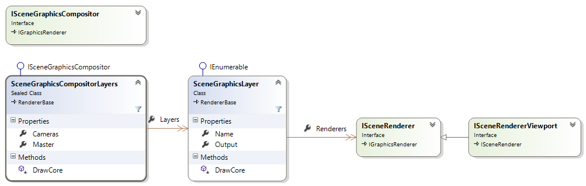
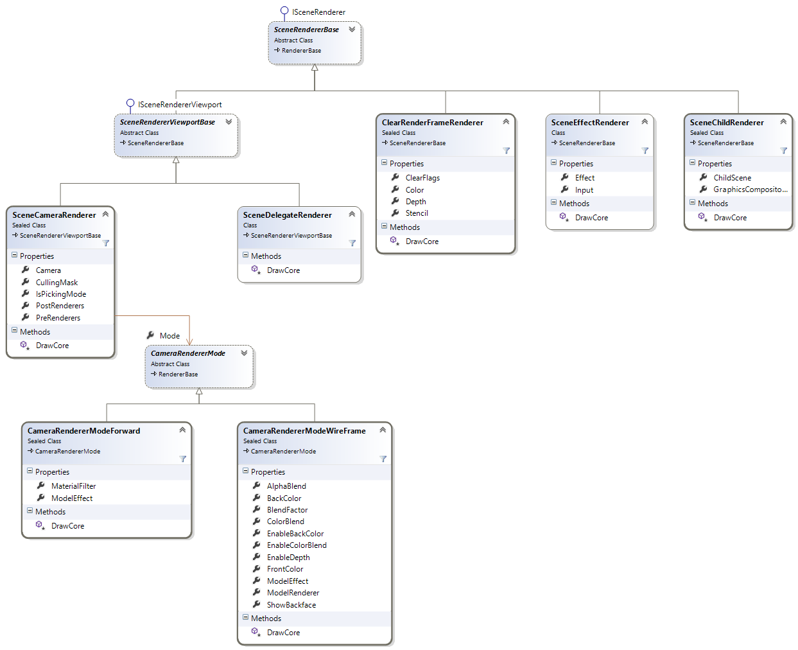

# Graphics Compositor For Developers

The following diagram shows the Scene Graphics Compositor by Layers interfaces and implementation classes:

- The `SceneGraphicsCompositorLayers (ref:{SiliconStudio.Xenko.Rendering.Composers.SceneGraphicsCompositorLayers})` is the default implementation of `ISceneGraphicsCompositor (ref:{SiliconStudio.Xenko.Rendering.Composers.ISceneGraphicsCompositor})` and provides a layered based compositor system
- It contains a collection of cameras slots
- A collection of `SceneGraphicsLayer (ref:{SiliconStudio.Xenko.Rendering.Composers.SceneGraphicsLayer})`
- Each layer contains a collection of `ISceneRenderer (ref:{SiliconStudio.Xenko.Rendering.ISceneRenderer})`

 

# Renderers

The default renderers implementing the `ISceneRenderer (ref:{SiliconStudio.Xenko.Rendering.ISceneRenderer})`

- `SceneCameraRenderer (ref:{SiliconStudio.Xenko.Rendering.SceneCameraRenderer})` to render the current scene from a camera
- `SceneDelegateRenderer (ref:{SiliconStudio.Xenko.Rendering.SceneDelegateRenderer})` to delegate the rendering to a method callback
- `ClearRenderFrameRenderer (ref:{SiliconStudio.Xenko.Rendering.ClearRenderFrameRenderer})` to clear the colors/depth of a render frame
- `SceneEffectRenderer (ref:{SiliconStudio.Xenko.Rendering.SceneEffectRenderer})`to apply an image effect to a render frame
- `SceneChildRenderer (ref:{SiliconStudio.Xenko.Rendering.SceneChildRenderer})`to render a child scene to a render frame

 

 

 

