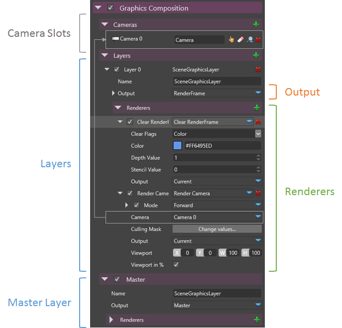
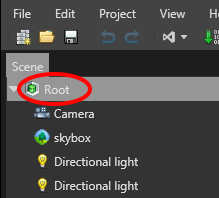
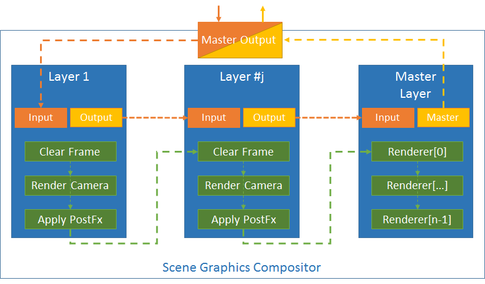

# Graphics Compositor Overview

 

With the graphics compositor you can:

- Render one or multiple scene using
  - one or multiple cameras camera 
  - filtering entities in the scene
  - to one or multiple render targets with a different viewports
- Render a child scene (another "game part" or "scene layer") within another scene
- Render a scene with a camera to a render target that will be used as the input texture of a Material/Effect in a scene (e.g  render the rearview mirror point-of-view to a texture, and display it at the rear-view mirror place)
- Easily mix rendering mode (Forward, Forward+/Deferred - in a future release -...etc), at the same time in the same graphics composition
- Easily mix HDR and LDR rendering
- Apply Image/PostProcessing Effects on a render target, select before/after the rendering of a camera.
- Allow to easily clear a render target or clear only the depth buffer (to render for example always on top of a render target in a FPS game, or to render the UI)
- Manipulate the compositor from scripts (or any animation system) in the scene to modify the composition, enable effects...etc.

The graphics compositor is accessible by clicking on the scene root object and the properties of the graphics compositor will appear in the property editor.

 

 

> **Note**
> 
> 
>     
>             
>     
>     
> 
> Note that while the Scene Graphics Compositor is currently editable only through the property editor, we will add in a future release a dedicated editor to considerably ease the use of it    

# Concepts

The graphics compositor is a pluggable system (you can write your own compositor) and currently comes with a default **compositor by layers**.

 

Graphics composition by layers is an easy concept to grasp, as it is often used by many popular drawing applications.

It is based on the following concepts:

- Camera slots
- RenderFrame
- Layers
- Renderers

## Camera Slots

Because a camera can be setup in different renderers and different layers, it is more practical to define a set of Camera at the scene graphics compositor level, and reference the camera in the renderers via a slot.

It allows to change/set the actual camera for a particular slot just once at the graphics compositor level, while many renderers may reference the same camera slot.

## RenderFrame

A Render Frame defines:

- the output texture/render target to receive the final color
- an optional depth stencil buffer that will be used for rendering.
- If the rendering frame is HDR or LDR
- How the size is computed based on the main window size (relative or absolute)

A default render frame is always created for the output window and is setup by default for the top root scene graphics compositor.

## Layers

A layer contains:

- A **render frame output**
- An **implicit render frame input** bound to the output of the previous layer
- A **list of renderers**

The graphics compositor is defined by:

- A list of variable layers
- A fixed layer called the **Master** **Layer**.
- Each layers are rendered in the order they are defined.
- The output of the Master layer is always bound to the default output of scene graphics compositor and cannot be changed (See advanced composition for more details)

## Renderers

A renderer defines a specific rendering action. Several renderers are provided by default:

- [Clear RenderFrame](scene-renderers/clear-renderframe.md)
- [Render Camera](scene-renderers/render-camera.md)
- [Render Effect](scene-renderers/render-effect.md)
- [Render Child Scene](scene-renderers/render-child-scene.md)

