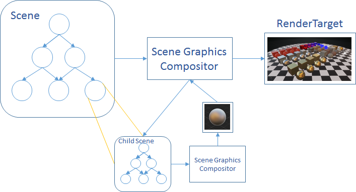

# Graphics Compositor Reference

The scene graphics compositor is responsible to render a scene to one or multiple render targets.

 

A graphics compositor is defined at a scene level. It has a definition and runtime that describe how to compose a scene to a final render target.

You can find more details about the graphics compositor in the following pages:

- [Graphics Compositor Overview](graphics-compositor-overview.md)
- [Scene Renderers](scene-renderers/index.md)
- [Graphics Compositor For Developers](graphics-compositor-for-developers/index.md)

