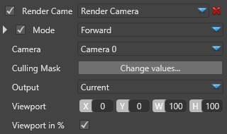

# Render Camera

Render all renderable entity components from the scene. 

 

# Properties

| Property      | Description                                                                                                               |
| ------------- | ------------------------------------------------------------------------------------------------------------------------- |
| Mode          | Select the rendering mode for this camera:                                                                                |
|               |                                                                                                                           |
|               | - Forward                                                                                                                 |
|               | - Wireframe                                                                                                               |
|               | - Forward+/Deferred (*these will be added in a future release*)                                                           |
|               |                                                                                                                           |
|               |                                                                                                                           |
| Camera        | Specify a Camera slot defined at the level of the Scene Graphics Compositor                                               |
| Culling Mask  | Allow to filter the entities that will be rendered by this instance                                                       |
| Output        | See Common properties in [Scene Renderers](index.md)                                                                      |
| Viewport      | The viewport where the rendering will occur on the render frame. By default, it takes the whole space (Width/Height 100%) |
| Viewport in % | If set to **true**, the **Viewport** is interpreted in percentage, otherwise in absolute.                                 |

 

 

