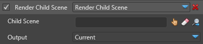

# Render Child Scene

Renders a child scene to a render frame.

> **Warning**
> 
> 
>     
>             
>     
>     
> 
> An entity with child scene component and an existing scene must be instantiated in the current scene in order to be able to render a child scene.    

# 

# Properties

| Property    | Description                                                          |
| ----------- | -------------------------------------------------------------------- |
| Child Scene | A reference to an entity in the scene that has a child scene defined |
| Output      | See Common properties in [Scene Renderers](index.md)                 |

 

 

