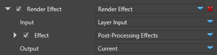

# Render Effect

Applies an effect to a render frame 

 

# Properties

| Property | Description                                                                                                |
| -------- | ---------------------------------------------------------------------------------------------------------- |
| Input    | Defines what is the input of the current effect                                                            |
|          |                                                                                                            |
|          | - Layer Input: Use the input of the current layer (the output of the previous layer). This is the default. |
|          | - Current: Use the output of the current layer                                                             |
|          | - Shared RenderFrame: Use a specific shared render frame asset                                             |
|          |                                                                                                            |
|          |                                                                                                            |
| Effect   | An image effect.                                                                                           |
| Output   | See Common properties in [Scene Renderers](index.md)                                                       |

