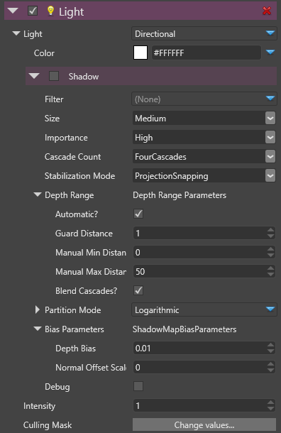
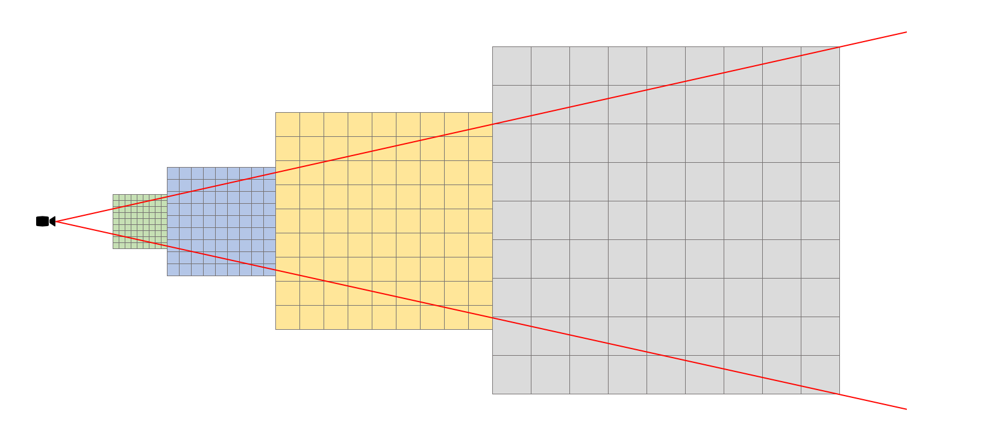

# Directional Lights

# Overview

A directional light is a light coming uniformly from one direction and is often used for simulating the sun or a light coming from a far distance.

 

 

In the studio, the directional light appears with the following icon:

 

 

 

 

 

 

Once selected, the gizmo of the directional light displays its main direction:

 

 

 

 

 

 

 

 

 

 

# Properties

Properties that defines a directional light:

 

 

| Property     | Description                                                                                                         |
| ------------ | ------------------------------------------------------------------------------------------------------------------- |
| Type         | Directional                                                                                                         |
| Color        | The color of this directional light.                                                                                |
|              |                                                                                                                     |
|              | *Note Currently, the light support an RGB color but will provide also temperature colors.*                          |
| Shadows      | All shadows properties are detailed below                                                                           |
| Intensity    | The intensity of this light. The color is basically multiplied by this value before sending the color to the shader |
|              |                                                                                                                     |
|              | *Note: Currently, this value has no units but this will change in the future.*                                      |
| Culling Mask | Defines which entity groups are affected by this light. By default, all groups are affected.                        |

# Shadows

Shadows bring significant information and realism to a scene.

| Shadows **off**                                          | Shadows **on**                                               |
| -------------------------------------------------------- | ------------------------------------------------------------ |
|   |   |

In the case of a directional light, shadows effect in a scene can spawn on a large view range hence requiring a special treatment to improve their realism.

## Cascades

The technique used for directional light shadows is called cascaded shadow mapping and consist in rendering depth of occluders objects from the point-of-view of the light to a texture and then rendering the scene taking into account this occluder information.

The cascade term implies that multiple textures are used to slice the depth range from the camera point-of-view, allocating more pixels for the view space closer to the camera.

 

 

If the debug property is set on the shadow, you can visualize the cascades. In the following example, we have a directional light configured with 4 cascades:

| Cascades Debug Off                                                   | Cascades Debug On                                                    |
| -------------------------------------------------------------------- | -------------------------------------------------------------------- |
|   |   |

The colors shows the selected cascade texture for each distance range (Green:0, Blue:1, Purple: 2, Red: 3)

## Properties

| Property            | Description                                                                                                                                                                                                                       |
| ------------------- | --------------------------------------------------------------------------------------------------------------------------------------------------------------------------------------------------------------------------------- |
| Filter              | Filtering allows to produce **soft shadows** instead of **hard shadows**. Currently, the implemented technique is PCF (Percentage Closer Filtering)                                                                               |
|                     |                                                                                                                                                                                                                                   |
|                     | *Note: Other techniques will be added*                                                                                                                                                                                            |
| Size                | The size of the shadow map texture. Values are **large**, **medium** and **small**.                                                                                                                                               |
| Importance          | The visual importance of this shadow map. Values are **high**, **medium** and **low**. See [shadow map atlas size calculation](shadows-optimizations.md) for details.                                                             |
|                     |                                                                                                                                                                                                                                   |
|                     | For a directional light, this value is by default **high**, as a directional light has more visual impact than a range limited light.                                                                                             |
| Cascade Count       | The number of cascades used for slicing the range of depth covered by the light. Values are 1, 2 or 4 cascades, though a typical scene would use 4 cascades.                                                                      |
| Stabilization mode  | Defines the technique used to lower the effect of shadow map flickering. Values are **none**, **Projection Snapping** and **View Snapping**.                                                                                      |
|                     |                                                                                                                                                                                                                                   |
|                     | Shadow map flickering is a result of the potential aliasing introduced by the shadow map technique, Whenever a texel from the point-of-view of the light covers more space than a texel from the camera point-of-view.            |
|                     |                                                                                                                                                                                                                                   |
|                     | - The projection snapping tries to snap the projection matrix of the light to snap it on a texel dependent on the resolution of the shadow map texture.                                                                           |
|                     | - The view snapping tries to snap the target of the view matrix of the light (center of the camera view cascade frustum)                                                                                                          |
|                     | - Both projection and view snapping force the shadow matrix to cover a larger region, increasing the aliasing of the shadow map texture.                                                                                          |
|                     |                                                                                                                                                                                                                                   |
|                     | Note that when using depth range camera is set to automatic, the stabilization mode is ignored.                                                                                                                                   |
| Depth Range         | Defines how is calculated the visible depth range from the camera point-of-view. This directly affects how near and how far cascades splits occur.                                                                                |
| Automatic           | If enabled, the visible depth range is read back from the actual depth buffer and the min and max view distance is calculated automatically.                                                                                      |
| Guard Distance      | A guard distance in meters per rendering frame that is added to ensure that when the camera is moving, the visible depth range is still valid. This property is only valid for the automatic depth range mode                     |
|                     |                                                                                                                                                                                                                                   |
|                     | For example, If the game is running at 60FPS and the guard distance is 1m, it means that the camera should not move faster than 1m per 1/60s.                                                                                     |
| Manual Min Distance | The minimum depth in meters, property valid when the automatic mode is disabled.                                                                                                                                                  |
| Manual Max Distance | The maximum depth in meters, property valid when the automatic mode is disabled.                                                                                                                                                  |
| Blend Cascades      | Determines whether to smooth the transition between cascades from the point-of-view. If set to false, there is no transition when the shadow is rendered with a different cascade.                                                |
| Partition mode      | Determines how cascades split distance is determined                                                                                                                                                                              |
|                     |                                                                                                                                                                                                                                   |
|                     | - **Manual**: the split is defined manually for each cascade, in percentage of the visible depth range. A value of 0.1 for a cascade means that the cascade is rendered on the distance 0.1 * (VisibleDepthMax - VisibleDepthMin) |
|                     | - **Logarithmic**: the split is automatically calculated using a logarithmic scale.                                                                                                                                               |
|                     |   - The PSSM factor allow to blend from a pure logarithmic scale (0.0f) to a pure uniform scale (1.0f)                                                                                                                            |
|                     |                                                                                                                                                                                                                                   |
|                     |                                                                                                                                                                                                                                   |
| Bias Parameters     | These parameters are used to avoid some artifacts of the shadow map technique                                                                                                                                                     |
| Depth Bias          | The amount of depth to add to the sampling depth to avoid the phenomenon of shadow acne.                                                                                                                                          |
| Normal Offset Scale | A factor multiplied by the depth bias toward the normal                                                                                                                                                                           |
| Debug               | For debugging purpose, if set to true, the shadow map will display a color per cascade.                                                                                                                                           |

 

 

 

