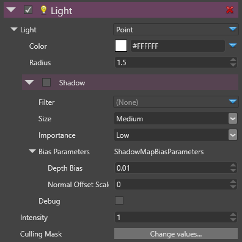

# Point Lights

# Overview

A point light is emitting light in all directions within a sphere region.

 

In the studio, the point light appears with the following icon:

 

Once selected, the gizmo of the point light displays its sphere influence:

 

 

> **Note**
> 
> 
>     
>             
>     
>     
> 
> Shadows for point lights are not yet supported in 1.1.x-beta versions    

# Properties

Properties that defines a point light:

 

 

| Property            | Description                                                                                                                                         |
| ------------------- | --------------------------------------------------------------------------------------------------------------------------------------------------- |
| Type                | Point                                                                                                                                               |
| Color               | The color of this point light                                                                                                                       |
|                     |                                                                                                                                                     |
|                     | *Note Currently, the light support an RGB color but will provide also temperature colors.*                                                          |
| Radius              | The sphere influence radius distance in meters. Above the range distance, the light doesn't affect models                                           |
| Shadows             | All shadows properties are detailed below                                                                                                           |
| Filter              | Filtering allows to produce **soft shadows** instead of **hard shadows**. Currently, the implemented technique is PCF (Percentage Closer Filtering) |
|                     |                                                                                                                                                     |
|                     | *Note: Other techniques will be added*                                                                                                              |
| Size                | The size of the shadow map texture. Values are **large**, **medium** and **small**.                                                                 |
| Importance          | The visual importance of this shadow map. Values are **high**, **medium** and **low**. See shadow map atlas size calculation for details.           |
|                     |                                                                                                                                                     |
|                     |  *For a point light, this value is by default to **low**.*                                                                                          |
| Bias Parameters     | These parameters are used to avoid some artifacts of the shadow map technique                                                                       |
| Depth Bias          | The amount of depth to add to the sampling depth to avoid the phenomenon of shadow acne.                                                            |
| Normal Offset Scale | A factor multiplied by the depth bias toward the normal                                                                                             |
| Intensity           | The intensity of this light. The color is basically multiplied by this value before sending the color to the shader                                 |
|                     |                                                                                                                                                     |
|                     | *Note: Currently, this value has no units but this will change in the future.*                                                                      |
| Culling Mask        | Defines which entity groups are affected by this light. By default, all groups are affected.                                                        |

 

 

 

 

