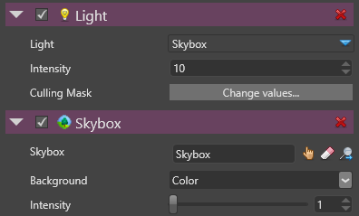

# Skybox Lights

# Overview

A skybox light is an ambient light emitted by a skybox.

 

 

In order to use a skybox light, an entity must have both:

- a Light of type Skybox
- a **Skybox Component**

> **Note**
> 
> 
>     
>             
>     
>     
> 
> If the Skybox Component is enabled, both the lighting and the skybox background are displayed, otherwise only the lighting is displayed    

 

The following images show the difference between ambient and skybox lighting and the impact of the skybox lighting on various materials:

| Ambient Lighting                                     | Skybox Lighting                                                                            | Skybox Lighting                                                                    | Skybox Lighting                                                                                    | Skybox Lighting                                                                                      |
| ---------------------------------------------------- | ------------------------------------------------------------------------------------------ | ---------------------------------------------------------------------------------- | -------------------------------------------------------------------------------------------------- | ---------------------------------------------------------------------------------------------------- |
|   |   |   |   |   |
|                                                      |                                                                                            |                                                                                    |                                                                                                    |                                                                                                      |
| Material Pure Diffuse                                | Material Pure Diffuse                                                                      | Material Plastic                                                                   | Metal 100% Gloss 50%                                                                               | Metal 100% Gloss 100%                                                                                |

# Properties

Properties that defines a skybox light:

 

 

| Property     | Description                                                                                                                                                                                    |
| ------------ | ---------------------------------------------------------------------------------------------------------------------------------------------------------------------------------------------- |
| Type         | Skybox                                                                                                                                                                                         |
| Intensity    | The intensity of this light. The color sampled from the skybox is basically multiplied by this value and the intensity defined in the Skybox Component before sending the color to the shader. |
|              |                                                                                                                                                                                                |
|              | Hence the final color is defined as:                                                                                                                                                           |
|              |                                                                                                                                                                                                |
|              | `final Color = Skybox Sampler Color * Light Skybox Intensity * Skybox Intensity`                                                                                                               |
|              |                                                                                                                                                                                                |
|              | *Note: Currently, this value has no units as it is dependent on the values coming from the skybox.*                                                                                            |
| Culling Mask | Defines which entity groups are affected by this light. By default, all groups are affected.                                                                                                   |

 

 

 

 

