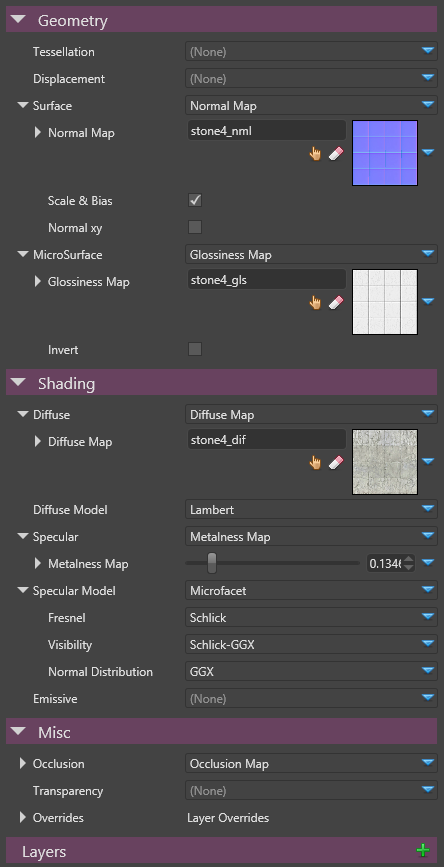

# Materials Reference

A Material defines the appearance of the surface of a 3D model and how it reacts to light. A Material can have an impact on both the geometry of a model (vertex shading) as well as on pixels (pixel shading).

 

 

A Material can use multiple layers of materials in order to build more complex materials.

 

In practice, a material will generate a partial definition of a Shader that will be integrated as part of the shading of a model (lighting and shadows).

# See Also

- [Material Colors](material-colors.md)
- [Material Attributes](material-attributes.md)
- [Material Layers](material-layers.md)
- [Materials For Developers](materials-for-developers.md)

 

 

