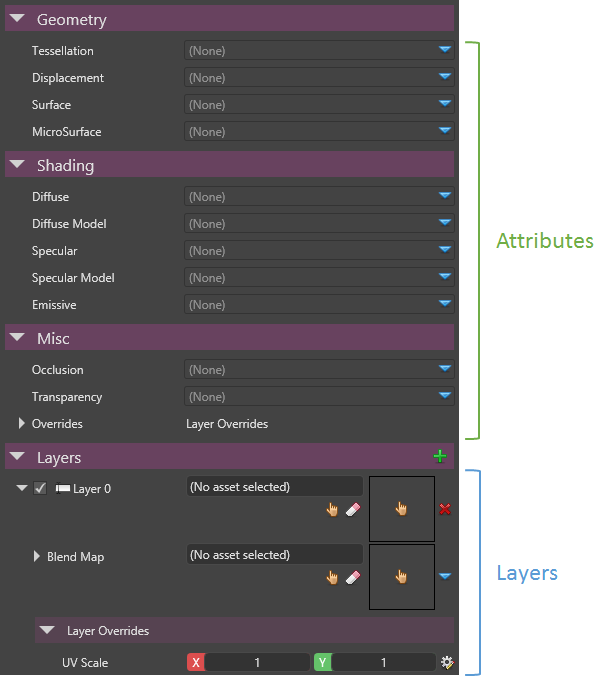
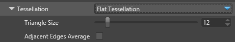
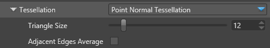
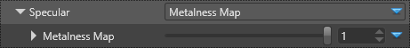
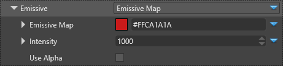
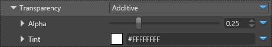

# Material Attributes

Material attributes define the core characteristics of the material like the diffuse color, diffuse shading model...etc. 

 

There are 2 types of attributes:

- Attributes used as input values for a shading model. For example: The Diffuse attribute provides only color used by the diffuse shading model.
- Attributes that can change the shading model. For example: The Diffuse Shading Model (like Lambert) interprets the diffuse attribute color.

Attributes contribute to a layer of a material. If a material is directly used as a model material, all its root attributes are considered as part of the first layer.

A material needs to have at least one attribute shading model declared in order to display something:

- Diffuse Model (with Diffuse color)
- Specular Model (With Specular color, possibly Diffuse Color and MicroSurface)
- Emissive

Attributes are organized in 3 categories: Geometry, Shading and Misc.

.. contents::

 

# Geometry Attributes

They define the shape of the material:

- Tessellation
- Displacement
- Surface (macro surface definition like normal maps)
- MicroSurface (micro surface definition like gloss maps)

## Tessellation

Realtime tessellation use a HW feature of the GPU to massively subdivide triangles in order to increase the realism and potential of deformations of the surface geometry.

 

| No Tessellation                                                        | Flat Tessellation                                                      | Point Normal Tessellation                                              |
| ---------------------------------------------------------------------- | ---------------------------------------------------------------------- | ---------------------------------------------------------------------- |
|   |   |   |

### Flat Tessellation

Tessellates the mesh uniformly with a flat tessellation.

 

 

The following snapshot shows that the flat tessellation is adding extra triangles to the existing triangles, while the curve is not taken into account:

| No Tessellation                                                        | **→**  | Flat Tessellation                                                      |
| ---------------------------------------------------------------------- | ------ | ---------------------------------------------------------------------- |
|   |        |   |
|                                                                        |        |                                                                        |
|                                                                        |        |                                                                        |
|                                                                        |        |                                                                        |
|                                                                        |        |                                                                        |
|                                                                        |        |                                                                        |
|                                                                        |        |                                                                        |
|                                                                        |        |                                                                        |
|                                                                        | **→**  |                                                                        |

| Property               | Description                                                                   |
| ---------------------- | ----------------------------------------------------------------------------- |
| Triangle Size          | The size of a tessellated triangle in screen-space units                      |
| Adjacent Edges Average | Adjust the **triangle size** values from the average of adjacent edges values |

### Point Normal Tessellation

Tessellates the mesh using the curvature provided by the normals of the mesh.

 

 

The following snapshot shows that the point normal tessellation is adding extra triangles to the existing triangles, while keeping the curvature of the mesh into account:

| No Tessellation                                                        | **→**  | Point Normal Tessellation                                              |
| ---------------------------------------------------------------------- | ------ | ---------------------------------------------------------------------- |
|   |        |   |
|                                                                        |        |                                                                        |
|                                                                        |        |                                                                        |
|                                                                        |        |                                                                        |
|                                                                        |        |                                                                        |
|                                                                        |        |                                                                        |
|                                                                        |        |                                                                        |
|                                                                        |        |                                                                        |
|                                                                        | **→**  |                                                                        |

| Property               | Description                                                                                            |
| ---------------------- | ------------------------------------------------------------------------------------------------------ |
| Triangle Size          | The size of a tessellated triangle in screen-space units                                               |
| Adjacent Edges Average | Adjust the **triangle size** and **normal curvature** values from the average of adjacent edges values |

## Displacement

### Displacement Map

Displaces the geometry of the mesh using a displacement map.

 

 

Depending on the stage the displacement is applied, the results can be significantly different:

| Displacement with Vertex Shader                                          | Tessellation with Displacement                                           |
| ------------------------------------------------------------------------ | ------------------------------------------------------------------------ |
|   |   |

| Property         | Description                                                                                                                                                               |
| ---------------- | ------------------------------------------------------------------------------------------------------------------------------------------------------------------------- |
| Displacement Map | The displacement texture as a [Material Color Provider](material-colors.md).                                                                                              |
| Intensity        | The intensity of displacement                                                                                                                                             |
| Scale & Bias     | When enabled, the value coming from the texture is considered as a positive value ranging from 0.0 to 1.0 and the shader will apply a scale to get the range -1.0 to 1.0. |
| Shader Stage     | Specify on which shader stage the displacement map should be applied:                                                                                                     |
|                  |                                                                                                                                                                           |
|                  | - Vertex Shader                                                                                                                                                           |
|                  | - Domain Shader (used with Tessellation)                                                                                                                                  |
|                  |                                                                                                                                                                           |
|                  |                                                                                                                                                                           |

## Surface

An attribute that defines the macro surface normals.

 

 

### Normal Map

A map that provides per-pixel normal perturbation of the normal of the mesh.

 

 

The [normal mapping](http://en.wikipedia.org/wiki/Normal_mapping)  technique is widely used to enhance the realism of a low poly mesh:

| Flat                                                                     | Using a Normal Map                                                       |
| ------------------------------------------------------------------------ | ------------------------------------------------------------------------ |
|   |   |

| Property     | Description                                                                                                                                                               |
| ------------ | ------------------------------------------------------------------------------------------------------------------------------------------------------------------------- |
| Normal Map   | The normal map color provider.                                                                                                                                            |
| Scale & Bias | When enabled, the value coming from the texture is considered as a positive value ranging from 0.0 to 1.0 and the shader will apply a scale to get the range -1.0 to 1.0. |
| Normal xy    | When enabled, assume that only the (x,y) are valid and z = 1.0                                                                                                            |

## MicroSurface

An attribute that defines the behavior of the micro surface fine grained normals.

### Glossiness Map

A map that provides per-pixel information for glossiness.

- A value of 1.0 means that the surface is highly glossy (the coarse normal is not perturbed)
- A value of 0.0 means that the surface is very rough (the coarse normal is highly perturbed in several directions)

 

 

In the screenshots below, using a material with the following attributes, we can see the result of the glossiness factor on the material:

- Diffuse = #848484, Lambert
- Specular Metalness = 1.0, GGX

| Glossiness = 0.0                                                         | 0.25                                                                     | 0.5                                                                      | 0.8                                                                      | 1.0                                                                      |
| ------------------------------------------------------------------------ | ------------------------------------------------------------------------ | ------------------------------------------------------------------------ | ------------------------------------------------------------------------ | ------------------------------------------------------------------------ |
|   |   |   |   |   |

| Property       | Description                                                                     |
| -------------- | ------------------------------------------------------------------------------- |
| Glossiness Map | The glossiness map color provider                                               |
| Invert         | When enabled, considers the map as a roughness map instead of a glossiness map. |
|                |                                                                                 |
|                | - A roughness value of 1.0 means a glossiness value of 0.0                      |
|                | - A roughness value of 0.0 means a glossiness value of 1.0                      |
|                |                                                                                 |
|                |                                                                                 |

# Shading Attributes

The shading attributes define the main color characteristics of the material and how it reacts to the lights.

> **Note**
> 
> 
>     
>             
>     
>     
> 
> At least one shading model - diffuse, specular or emissive model -  must be selected in order to display a material.    

## Diffuse Color

The diffuse final contribution is calculated from:

- The Diffuse defines the color used by the diffuse model
- The Diffuse Model defines which shading model is used for rendering the diffuse component

Currently, the Diffuse attribute supports only a **Diffuse Map** and the shading model only the **Lambert** model.

 

## Diffuse Model

The default diffuse model supported is the **Lambert** model.

A Lambert diffuse material implies that the light is reflected equally into all directions with an intensity following a cosine angular distribution (angle between the normal and the light):

 

 

In the screenshot below, we can see a pure diffuse material with Lambert lighting:

 

> **Note**
> 
> 
>     
>             
>     
>     
> 
> A pure Lambertian material does not exist in practice. A material has always a bit of specular reflection. This effect is more visible at grazing angles (a mostly diffuse surface becomes shiny at grazing angle)    

| Property      | Description                                                                  |
| ------------- | ---------------------------------------------------------------------------- |
| Diffuse Map   | The diffuse map color provider.                                              |
| Diffuse Model | The shading model for diffuse lighting. Currently, only Lambert is supported |

## Specular Color

The specular color can be defined using two popular workflow:

- Metalness workflow: The specular color is calculated by using the diffuse color as a base color.
- Specular workflow: The specular color is defined separately from the diffuse color.

### Metalness Map

The metalness workflow is easy to use as it simplifies parametrization between the diffuse and specular color.

By taking into into account the fact that almost all materials always have some "metalness"/reflectance in them, the metalness workflow allows to provide realistic materials with a minimal and easy to grasp parametrization.

With the metalness workflow, the final specular color is calculated by mixing between a fixed low reflectance color and the diffuse color.

- When the metalness color = 0.0, the effective specular color is equal to 0.02, while the diffuse color is unchanged. It means that the material is not metal but exhibits some reflectance and is sensitive to the Fresnel effect.
- When the metalness color = 1.0, the effective specular color equal to the diffuse color, and the diffuse color is set to 0. The material is then considered as a pure metal.

 

 

In the screenshots below, using a material with the following attributes, we can see the result of the metalness factor on the material:

- Glossiness = 0.8
- Diffuse = #848484, Lambert
- Specular GGX

| Pure Diffuse (No Metalness)                                               | Metalness = 0.0                                                          | Metalness = 1.0                                                          |
| ------------------------------------------------------------------------- | ------------------------------------------------------------------------ | ------------------------------------------------------------------------ |
|    |   |   |
| - The diffuse color is dominant                                           | - The diffuse color is dominant                                          | - The diffuse color is not visible                                       |
| - The specular color is not visible                                       | - The specular color is visible (0.02)                                   | - The specular color is visible                                          |
| - There is no Fresnel:                                                    | - The Fresnel effect is slightly visible:                                | - The Fresnel effect is visible:                                         |
|                                                                           |                                                                          |                                                                          |
|    |   |   |

### Specular Map

The specular workflow provides more control on the actual specular color but requires to carefully modify the diffuse color accordingly.

Unlike the metallness workflow, It allows to have a different specular color from the diffuse color even in low reflectance scenarios, allowing some materials with special behavior.

> **Note**
> 
> 
>     
>             
>     
>     
> 
> With the layering system, it is still possible to combine into a same material a metalness and specular workflow.    

## Specular Model

A pure specular surface is producing an highlight of a light in a mirror direction. In practice, there is a broad range of specular materials, not entirely smooth that can reflect the light not in a single direction.

The default specular model used to support these various scenarios is the **microfacet** model also known as [Cook-Torrance](http://www.cs.columbia.edu/~belhumeur/courses/appearance/cook-torrance.pdf) .

 

The microfacet is defined by the following formula, where Rs is the resulting specular reflectance:

 

| Property            | Description                                                                                                                                                                |
| ------------------- | -------------------------------------------------------------------------------------------------------------------------------------------------------------------------- |
| Fresnel             | Defines the amount of the incoming light that is reflected and transmitted. The models supported are:                                                                      |
|                     |                                                                                                                                                                            |
|                     | - **Schlick**: An approximation of the Fresnel effect (*default*)                                                                                                          |
|                     | - **None**: Use the color of the material as-is without taking into account the Fresnel effect.                                                                            |
|                     |                                                                                                                                                                            |
|                     |                                                                                                                                                                            |
| Visibility          | Defines an amount of visibility between of the microfacets between (0, 1). Also known as the geometry attenuation - Shadowing and Masking - in the original Cook-Torrance. |
|                     |                                                                                                                                                                            |
|                     | In our implementation, we have simplified the formula to use the Visibility term instead :                                                                                 |
|                     |                                                                                                                                                                            |
|                     |       and                    |
|                     |                                                                                                                                                                            |
|                     | - **Schlick GGX** (*default*)                                                                                                                                              |
|                     | - **Implicit**: The microsurface is always visible and doesn't generate any shadowing or masking.                                                                          |
|                     | - **Cook-Torrance**                                                                                                                                                        |
|                     | - **Kelemen**                                                                                                                                                              |
|                     | - **Neumann**                                                                                                                                                              |
|                     | - **Smith-Beckmann**                                                                                                                                                       |
|                     | - **Smith-GGX correlated**                                                                                                                                                 |
|                     | - **Schlick-Beckmann**                                                                                                                                                     |
|                     |                                                                                                                                                                            |
|                     |                                                                                                                                                                            |
| Normal Distribution | Defines how the normal is distributed. The glossiness attribute is used by this part of the function to modify the distribution of the normal.                             |
|                     |                                                                                                                                                                            |
|                     | - **GGX** (*default*)                                                                                                                                                      |
|                     | - Beckmann                                                                                                                                                                 |
|                     | - **Blinn-Phong**                                                                                                                                                          |
|                     |                                                                                                                                                                            |
|                     |                                                                                                                                                                            |

## Emissive Model

An emissive material is a surface emitting a light.

 

With a HDR rendering and a bloom post-processing effect, we can observe the influence of an emissive material:

 

 

| Property     | Description                                                                                                                                            |
| ------------ | ------------------------------------------------------------------------------------------------------------------------------------------------------ |
| Emissive Map | The emissive map color provider                                                                                                                        |
| Intensity    | A factor to multiply by the color of the color provider                                                                                                |
| Use Alpha    | When enabled, the alpha of the emissive map is used as the main alpha color of the material (instead of using by default the alpha of the diffuse map) |

# Misc Attributes

## Occlusion

The Occlusion Map is the default occlusion attribute. The occlusion map use geometry occlusion information backed into a texture in order to modulate the ambient and direct lighting.

 

 

The following screenshots gives an example of usage of occlusion maps and cavity maps:

| Occlusion Map                                                            | Cavity Map                                                               | Final Composition                                                        |
| ------------------------------------------------------------------------ | ------------------------------------------------------------------------ | ------------------------------------------------------------------------ |
|   |   |   |
|                                                                          |                                                                          |                                                                          |
| Coarse occlusion of the ambient light                                    | Fine grained occlusion of direct light                                   | Result                                                                   |

| Property                  | Description                                                                                                                                            |
| ------------------------- | ------------------------------------------------------------------------------------------------------------------------------------------------------ |
| Occlusion Map             | The occlusion map scalar provider that determines how much ambient light is accessible on the material:                                                |
|                           |                                                                                                                                                        |
|                           | - A value of 1.0 means that the material is fully lighted by Ambient lighting (Skybox, Ambient lights...etc.)                                          |
|                           | - A value of 0.0 means that the material is not lighted by the ambient lighting                                                                        |
|                           |                                                                                                                                                        |
|                           |                                                                                                                                                        |
| Direct Lighting Influence | Applies to Occlusion Map and allow to influence direct lighting as well.                                                                               |
| Cavity Map                | The cavity map scalar provider is multiplied with direct lighting. It allows to define very fine grained cavity where the direct light could not enter |
|                           |                                                                                                                                                        |
|                           | The cavity map is usually defined for thin concave cavity.                                                                                             |
| Diffuse Cavity            | A factor for diffuse lighting influence of the cavity map. A value of 1.0 means that the cavity map fully influence the diffuse lighting.              |
| Specular Cavity           | A factor for specular lighting influence of the cavity map. A value of 1.0 means that the cavity map fully influence the specular lighting.            |

## Transparency

### Cuttoff

Renders a material when the current alpha color is above a threshold.

 

 

The following screenshots show the influence of the cutoff Alpha value.

| Alpha = 0.01                                                             | Alpha = 0.5                                                              | Alpha = 1.0                                                              |
| ------------------------------------------------------------------------ | ------------------------------------------------------------------------ | ------------------------------------------------------------------------ |
|   |   |   |

### Additive

Additive transparency allows to render a model from a purely additive - taking into account only the specular material part - to a semi-opaque material - taking into account the diffuse and diffuse/emissive alpha.

 

 

The Alpha property has a particular meaning:

- If Alpha <= 0.5, the material is rendered in additive mode without the diffuse component (only specular highlights)
  
  | Transparency Alpha = 0.25                                                | Alpha = 0.5                                                              |
  | ------------------------------------------------------------------------ | ------------------------------------------------------------------------ |
  |   |   |
  |                                                                          |                                                                          |
  | We only see the specular highlight in additive mode                      | Transparency is fully additive. Specular highlights at maximum           |
- If Alpha <= 1.0, the material is rendered in semi-opaque mode with the diffuse/emissive component. If the diffuse component has an alpha, it will be displayed as transparent
  
  | Alpha = 0.75                                                             | Alpha = 1.0                                                              |
  | ------------------------------------------------------------------------ | ------------------------------------------------------------------------ |
  |   |   |
  |                                                                          |                                                                          |
  | Specular highlights, diffuse with alpha and semi-opaque diffuse          | Specular highlights, diffuse with alpha and opaque diffuse               |

| Property | Description                                                                                                                                                                  |
| -------- | ---------------------------------------------------------------------------------------------------------------------------------------------------------------------------- |
| Alpha    | The alpha value is interpreted like this:                                                                                                                                    |
|          |                                                                                                                                                                              |
|          | - Alpha <= 0.5, the material is rendered in additive mode without the diffuse component (only specular highlights)                                                           |
|          | - Alpha <= 1.0, the material is rendered in semi-opaque mode with the diffuse/emissive component. If the diffuse component has an alpha, it will be displayed as transparent |
|          |                                                                                                                                                                              |
|          |                                                                                                                                                                              |
| Tint     | Apply a color tint to the transparency layer                                                                                                                                 |

