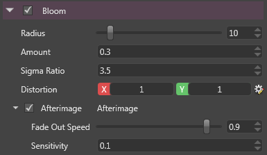

# Bloom

The bloom effect takes the brightest areas of an image, extends them and makes them bleed on the surrounding areas, to simulate bright light overwhelming the camera.

 

It uses as input the result of the [Bright Filter](bright-filter.md).

 

# Properties

| Property       | Description                                                                                                                                                                                                                                                  |
| -------------- | ------------------------------------------------------------------------------------------------------------------------------------------------------------------------------------------------------------------------------------------------------------ |
| Radius         | Radius of the bloom.                                                                                                                                                                                                                                         |
|                |                                                                                                                                                                                                                                                              |
|                | *High values can impact performances.*                                                                                                                                                                                                                       |
| Amount         | Amount/strength of bloom.                                                                                                                                                                                                                                    |
| Sigma Ratio    | This affects the fall-off of the bloom. It is the [standard deviation](http://en.wikipedia.org/wiki/Standard_deviation)  (sigma) used in the [Gaussian blur](http://en.wikipedia.org/wiki/Gaussian_blur)  formula when calculating the kernel of the bloom.  |
| Distortion     | Can stretch the image horizontally or vertically.                                                                                                                                                                                                            |
| Afterimage     | When enabled, it simulates some persistence of vision or [afterimage](http://en.wikipedia.org/wiki/Afterimage) . The longer you look at a bright sport, the more it gets "burnt" into your retina.                                                           |
|                |                                                                                                                                                                                                                                                              |
|                |                                                                                                                                                                                                                     |
| Fade Out Speed | The factor by which the persistence decreases at each frame (1 means infinite persistence, while 0 means no persistence at all)                                                                                                                              |
| Sensitivity    | How much the retina is sensitive to the bright light.                                                                                                                                                                                                        |

