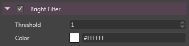

# Bright Filter

The bright filter extracts the areas of an image which are the brightest. 

So the bright pass in itself is not a post-effect, but its result is used later by other effects like the bloom, the light streaks, the lens-flares...

 

# Properties

| Property  | Description                                                                                                                                    |
| --------- | ---------------------------------------------------------------------------------------------------------------------------------------------- |
| Threshold | Influences the threshold used to determine if a color passes or fails the bright filter.                                                       |
| Color     | Color modulator: the result of the bright filter is modulated by this color value, then affecting the color of the bloom, the light streaks... |
|           |                                                                                                                                                |
|           | If set to white, the color is not modified.                                                                                                    |

