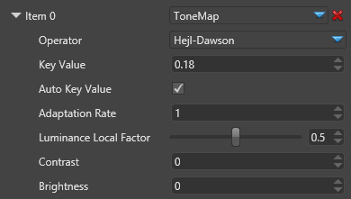

# ToneMap

Tone-mapping takes as input an HDR buffer, and re-map its color to a [0, 255] range so we can display it on a screen.

Obviously there are many possible ways to remap colors from an HDR space to an LDR, depending on the formula you choose.

 

Several tone-mapping operators are supported out-of-the-box:

- Reinhard (the classic operator)
- Exponential
- Logarithmic
- Drago
- Hejl-Dawson
- Mike-Day
- U2-Filmic

