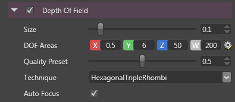

# Depth of Field

Depth of field simulates the behavior of a real camera lens focusing an object. 

By default, the rendering of a game engine produces a very sharp image, which can look a bit too artificial. 

In movies it is common to have the camera focus a specific object of the scene, leaving the background blurred and making very-close objects appear blurry and out-of-focus as well.

 

The "depth of field effect" is designed to produce such images.

Internally, the effect is achieved by creating several versions of the original image, with different intensity of blur and interpolate between them.

The more layers are used, the better the quality is, but at some performance cost.

 

 

# Properties

 

| Property   | Description                                                                                                                                                            |
| ---------- | ---------------------------------------------------------------------------------------------------------------------------------------------------------------------- |
| Size       | Size of the bokeh. It is a expressed as a factor of the image width so it is resolution-independent.                                                                   |
|            |                                                                                                                                                                        |
|            | *The bigger the size, the lower the performance is.*                                                                                                                   |
| DOF Areas  | Areas of the depth of field. There are 3 main zones defined by their distance from the camera:                                                                         |
|            |                                                                                                                                                                        |
|            | - near out-of-focus area, from X to Y                                                                                                                                  |
|            | - in-focus area, from Y to Z                                                                                                                                           |
|            | - far out-of-focus area, from Z to W                                                                                                                                   |
|            |                                                                                                                                                                        |
|            | *In the future we plan to support physical parameters for the camera (aperture, focal length) so this area settings will be replaced by the lens physical attributes.* |
| Technique  | The technique affects both the performance and the shape of the bokeh.                                                                                                 |
|            |                                                                                                                                                                        |
|            | - **Circular Gaussian**: circular shape, fast, but unrealistic                                                                                                         |
|            |                                                                                                                                                                        |
|            |                                                                                                             |
|            | - **Hexagonal Triple Rhombi**: hexagonal shape, heavier than Gaussian                                                                                                  |
|            |                                                                                                                                                                        |
|            |                                                                                                             |
|            | - **Hexagonal McIntosh**: hexagonal shape, can be more expensive than **Hexagonal Triple Rhombi**                                                                      |
|            |                                                                                                                                                                        |
|            |                                                                                                             |
|            |                                                                                                                                                                        |
|            |                                                                                                                                                                        |
|            |                                                                                                                                                                        |
|            |                                                                                                                                                                        |
| Auto Focus | When enabled, the DOF Areas are automatically updated so that the camera focuses on the object at the center of the screen.                                            |

 

 

