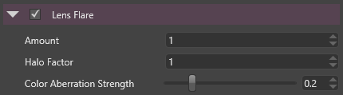

# Lens Flare

The lens flare effect simulates the artifacts produced by the internal reflection or scattering of the light within a real-world lens.

 

The artifacts are generally aligned along the line defined by the original bright spot and the center of the screen.

 

# Properties

| Property                  | Description                                                                                                                                           |
| ------------------------- | ----------------------------------------------------------------------------------------------------------------------------------------------------- |
| Amount                    | Amount/Strength of the light streak.                                                                                                                  |
| Halo Factor               | Strength of the main artifact.                                                                                                                        |
|                           |                                                                                                                                                       |
|                           | Among the lens flares artifacts the most noticeable one is often the exact symmetric to the real spot light with respect to the center of the screen. |
| Color Aberration Strength | Strength of the color aberration artifacts.                                                                                                           |

 

 

