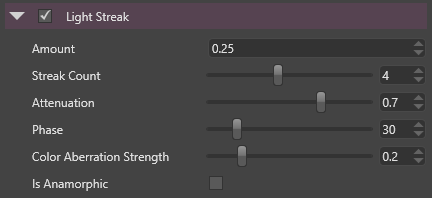

# Light Streaks

Similar to the [bloom effect](bloom.md), the light streak effect uses the result of the [bright filter](bright-filter.md) to make the bright areas bleed along some direction.

 

It creates star-pattern beams from the light point.

 

# Properties

| Property                  | Description                                                                                                                                                        |
| ------------------------- | ------------------------------------------------------------------------------------------------------------------------------------------------------------------ |
| Amount                    | Amount/Strength of the light streak.                                                                                                                               |
| Streak Count              | Number of beams emitted by a bright point.                                                                                                                         |
|                           |                                                                                                                                                                    |
|                           | *The performance cost of the effect is directly link to the number of streaks.*                                                                                    |
| Attenuation               | How fast the light attenuates along a streak. (0 for immediate attenuation, 1 for no attenuation)                                                                  |
| Phase                     | Phase (angle) of the star-like pattern.                                                                                                                            |
| Color Aberration Strength | Strength of the color aberration along the streaks.                                                                                                                |
|                           |                                                                                                                                                                    |
|                           |                                                                                                           |
|                           |                                                                                                                                                                    |
|                           | *Notice the streaks are not simply yellow but change to purple, green, pink...*                                                                                    |
| Is Anamorphic             | When enabled, it simulates the behavior of anamorphic lenses, which are widely used in big Hollywood productions.                                                  |
|                           |                                                                                                                                                                    |
|                           |                                                                                                           |
|                           |                                                                                                                                                                    |
|                           | *This exact effect was achieved by using 2 light streaks with a phase of 0, enabling anamorphic mode and slightly distorting horizontally the bright pass result.* |

 

 

