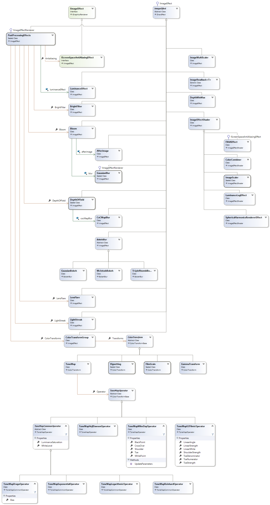

# Post-Effects For Developers

The following diagram shows the ImageEffects interfaces and implementation classes used to develop the post-processing effects:

- The interface `IImageEffect (ref:{SiliconStudio.Xenko.Rendering.Images.IImageEffect})` is the root interface for implementing an arbitrary image effect.
- The interface `IImageEffectRenderer (ref:{SiliconStudio.Xenko.Rendering.IImageEffectRenderer})` is the interface for implementing a post-effect that can be instantiated from the editor.
  - For example, `PostProcessingEffects (ref:{SiliconStudio.Xenko.Rendering.Images.PostProcessingEffects})` and `GaussianBlur (ref:{SiliconStudio.Xenko.Rendering.Images.GaussianBlur})` are inheriting from this interface and accessible from the editor
- The `ImageEffect (ref:{SiliconStudio.Xenko.Rendering.Images.ImageEffect})` is a base implementation of the `IImageEffect (ref:{SiliconStudio.Xenko.Rendering.Images.IImageEffect})`. It is recommended to derive from this class to develop a custom effect.

 

 

 

