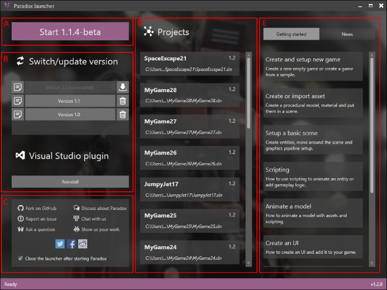
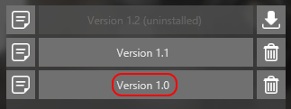
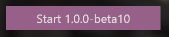
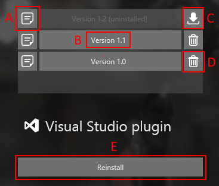
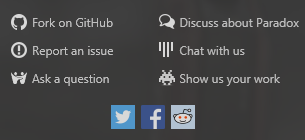
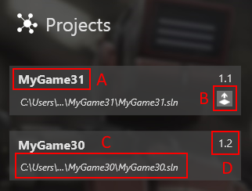
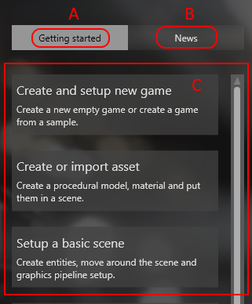

# Xenko Launcher

The **launcher** is the starting point of Xenko, with it you can:

- **Start Xenko Studio**
- **Open recent projects**
- **Manage the different versions** of Xenko
- Visualize the **release notes** of each versions
- Access **tutorials and news** about Xenko
- Find ways to **interact with the community**

# Overview

 

- A: Start the game studio
- B: Manage versions of xenko
- C: Interact with the community
- D: Open recent projects
- E: Last tutorials and news

# 

# Start the studio

To start the displayed version of Xenko just click on the button.

To change the version of xenko to launch, click on the version you want in the list (B)

        **→**        

Note: by default the launcher closes after starting the game studio. If you prefer keeping the launcher open you can uncheck the corresponding checkbox 

# 

# Manage versions

Using the launcher you can **install**, **uninstall** **a version** as well as view a **specific version release notes**.

 

- A: Display the release notes of the specific version
- B: The name of the version
- C: Download and install the version
- D: Uninstall and remove the version
- E: Reinstall the Visual Studio package

Note: The Visual Studio plugin is automatically installed when installing Xenko. But in the case the user removed it by mistake it can be reinstalled at any times from the launcher.

# 

# Interact with the community

The launcher proposes quick access to all the different ways to interact with us and the community.

 

Depending on your problem or need, click on the most adapted link and wait to be redirected.

# 

# Recent projects

The launch contains the list of all our recent projects.

The open a recent project simply click on the item.

Note that launcher is capable of determining the adequate version of Xenko, so you don't need to manually switch the version of Xenko before starting your project.

 

- A: The name of the project
- B: Update the project and open it with last version of Xenko.
- C: The absolute path to the project
- D: The version of Xenko of the project

# 

# Tutorials and news streams

The launcher also proposes you direct links to tutorials and news. 

Just click on the item to be automatically redirected to the website.

 

- A: Switch to the getting started stream
- B: Switch to the news stream
- C: The list of items

 

